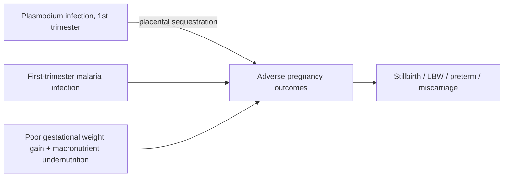

# Adverse Pregnancy Outcomes

**Therapeutic category:** _Not applicable — entity is a clinical outcome, not a drug._
**Drug group:** _N/A_
**Drug class:** _N/A_
**Controlled substance:** _N/A_

## Overview

"Adverse pregnancy outcomes" is an outcome cluster (stillbirth, low birth weight, preterm delivery, miscarriage), not a medication. Current claim corpus describes causes (malaria infection, poor gestational weight gain) and preventive pharmacotherapies (IPTp regimens) targeting this outcome in endemic Africa. Note structured per medication template but content reflects entity's true nature.

## Indication (Why is this medication prescribed?)

_Not applicable._ Outcome entity. Preventive agents indexed below target this outcome in [[pregnancy-malaria]] context.

## Mechanism of Action (How does it work?)

_Not applicable to entity._ Upstream causal pathways from claim set:

- [[plasmodium]] infection in first trimester → adverse outcomes; pregnant, endemic setting [c:959870d1].
- First-trimester [[malaria]] infection → adverse outcomes; endemic setting [c:6cab89a1].
- Poor gestational weight gain with [[macronutrient-undernutrition]] in 2nd/3rd trimester → adverse outcomes [c:b7940b67].

## Dosage and Administration

_No dose claims in current corpus._ Preventive regimens referenced by frequency only:

| Agent | Population | Frequency | Setting | Claim |
|---|---|---|---|---|
| [[sulfadoxine-pyrimethamine]] IPTp | Pregnant, 2nd/3rd trimester, sub-Saharan Africa | Monthly | Outpatient, endemic | [c:04e59442] |
| [[sulfadoxine-pyrimethamine]] IPTp | Pregnant, Africa | Monthly | Outpatient, endemic | [c:e6828295] [c:78afa71d] |
| [[dihydroartemisinin-piperaquine]] IPTp | Pregnant, Africa | Monthly (vs SP comparator) | Outpatient, endemic | [c:60506afe] [c:37d798b3] |

mg/kg, duration not in corpus. Do not infer.

## Contraindications (When not to use it)

_Not applicable — outcome entity._ No contraindication claims in corpus.

## Warnings and Precautions

- First-trimester [[malaria]] infection carries highest causal weight for this outcome cluster in endemic settings — monitor pregnancies presenting with fever or parasitemia early [c:6cab89a1] [c:959870d1].
- Concurrent [[macronutrient-undernutrition]] + poor gestational weight gain compounds risk in 2nd/3rd trimester [c:b7940b67].
- IPTp comparator data: [[dihydroartemisinin-piperaquine]] vs [[sulfadoxine-pyrimethamine]] head-to-head certainty rated **low** in corpus — do not substitute without policy guidance [c:37d798b3] (pending review).

## Side Effects

_Not applicable._ Outcome entity, not drug. Side-effect profile lives on preventive agents' own notes ([[sulfadoxine-pyrimethamine]], [[dihydroartemisinin-piperaquine]]).

## Drug Interactions

_Not applicable to entity._ See partner notes for IPTp agent interactions.

## Storage and Stability

_Not applicable — outcome entity has no storage parameters._

---

**Classifier note:** entity tagged `medication` but is an obstetric outcome. Recommend reclassify to `condition` or `outcome` for proper exporter mapping. All 8 claims preserved with population/setting qualifiers intact.

---
*Last regenerated: 2026-05-13T18:28:01Z. Source claims: 8. Evidence mix: 8 expert_opinion (all pending review). Certainty mix: 3 high · 4 moderate · 1 low.*
