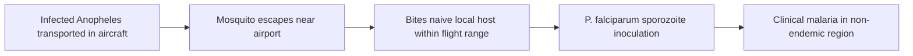

# Airport malaria

**Therapeutic category:** _Not applicable — entity is a disease entity, not a medication._
**Drug group:** _N/A_
**Drug class:** _N/A_
**Controlled substance:** _N/A_

> ⚠️ Entity-type mismatch: "airport malaria" is an epidemiological condition (locally-acquired [[malaria]] near airports in non-endemic regions, from imported infected [[anopheles-mosquito|Anopheles]] vectors), not a therapeutic agent. Note rendered against medication template per prompt; pharmacology sections empty by design.

## Overview

Airport malaria = locally-acquired malaria in [[non-endemic-region|non-endemic regions]] caused by infected mosquitoes transported via aircraft from endemic zones. France reported ~30 cases since 1969, predominantly [[plasmodium-falciparum|*Plasmodium falciparum*]] in immune-[[naive-host|naive]] hosts [c:0837df50] (pending review). Disease requires compulsory notification in France [c:0f1e0407] (pending review).

## Indication (Why is this medication prescribed?)

_Not applicable — no therapeutic indication. Entity is a reportable condition._

- Compulsory notification, France [c:0f1e0407] (pending review, expert_opinion).

## Mechanism of Action (How does it work?)

_Not pharmacological._ Transmission mechanism:

*P. falciparum* identified as causative species in French reported cases, immune-naive population [c:0837df50] (pending review).

## Dosage and Administration

_No dose claims in current corpus._

## Contraindications (When not to use it)

_Not applicable._

## Warnings and Precautions

Public-health precautions (not drug warnings):

- **[[aircraft-disinsection]]** — preventive against airport malaria, non-endemic setting [c:19dae890] (pending review, expert_opinion).
- **Perimeter [[vector-control]] within 400 m of airports** — preventive, [[french-overseas-territories]] endemic setting [c:4b56ad61] (pending review, expert_opinion).
- Mandatory case notification, France [c:0f1e0407] (pending review).

## Side Effects

_Not applicable — disease entity, no pharmacological adverse effect profile._

Clinical sequelae of underlying *P. falciparum* infection → see [[falciparum-malaria]] note.

## Drug Interactions

_Not applicable._

## Storage and Stability

_Not applicable._

---
*Last regenerated: 2026-05-13T18:28:28Z. Source claims: 4 (all pending_review). Evidence mix: 4 expert_opinion. Entity-type mismatch flagged — reclassify as `disease` / `epidemiological-condition` upstream.*
