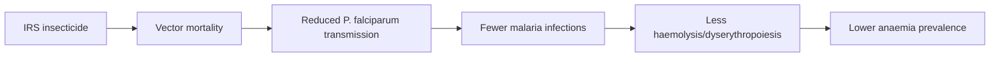

# Anaemia

**Therapeutic category:** _Not applicable — entity is a clinical condition, not a medication._
**Drug group:** _n/a_
**Drug class:** _n/a_
**Controlled substance:** _n/a_

## Overview

Entity classifier flagged `anaemia` as medication, but anaemia is a haematologic condition (reduced haemoglobin / red-cell mass), commonly secondary to malaria in endemic sub-Saharan Africa. Current corpus contains no pharmacologic claims for anaemia itself — all 4 claims describe [[indoor-residual-spraying]] (vector control) as upstream prevention of anaemia in [[itn]]-using communities. Note retained as stub pending re-classification.

## Indication (Why is this medication prescribed?)

- _No medication-indication claims in current corpus._
- Upstream prevention only: IRS with pyrethroid-like insecticides ([[ddt]] / [[deltamethrin]]) targets anaemia prevalence in [[sub-saharan-africa]] communities already using ITNs [c:c0de6166] [c:d61b7e6d].
- IRS with non-pyrethroid-like insecticides ([[bendiocarb]] / [[pirimiphos-methyl]] / [[propoxur]]) likewise [c:f098b7ec] (pending review) [c:320e8c41] (pending review).

## Mechanism of Action (How does it work?)

_No mechanism-of-action claims in current corpus._ Anaemia is a downstream outcome, not an agent. Vector-control claims act upstream by reducing [[plasmodium-falciparum]] transmission → fewer infections → less haemolysis and dyserythropoiesis → lower anaemia prevalence.

Cascade supported by meta-analytic risk ratios on anaemia endpoint [c:c0de6166] [c:d61b7e6d].

## Dosage and Administration

_No dose claims in current corpus._ Anaemia is not a drug; dosing not applicable. Insecticide application regimens (mg/kg, frequency, duration) not specified in source claims [c:c0de6166] [c:f098b7ec] [c:d61b7e6d] [c:320e8c41].

## Contraindications (When not to use it)

_No contraindication claims in current corpus._ Not applicable to a condition entity.

## Warnings and Precautions

- Effect sizes for IRS-on-anaemia are imprecise. Pyrethroid-like IRS vs ITNs alone: RR 1.12 (95% CI 0.89–1.40), evidence_grade meta_analysis, certainty low [c:c0de6166] [c:d61b7e6d] — CI crosses 1, no significant benefit over ITNs alone.
- Non-pyrethroid-like IRS vs ITNs alone: RR 0.46 (0.18–1.20) [c:f098b7ec] (pending review) and RR 0.71 (0.38–1.31) [c:320e8c41] (pending review) — point estimates favour benefit but CIs cross 1.
- Two PMIDs (31120132, 35038163) report overlapping pyrethroid-like estimates; non-pyrethroid-like estimates diverge (0.46 vs 0.71) — possible Cochrane update supersedence not encoded in `supersedes_id`. Flag for review.

## Side Effects

_No side-effect claims in current corpus._

## Drug Interactions

_No interaction claims in current corpus._

## Storage and Stability

_Not applicable._

---
*Last regenerated: 2026-05-13T18:29:13Z. Source claims: 4. Evidence mix: 4 meta_analysis (2 auto_promoted · 2 pending_review). Entity-type mismatch: classifier labelled `anaemia` as medication; recommend reclassification to `condition`.*
