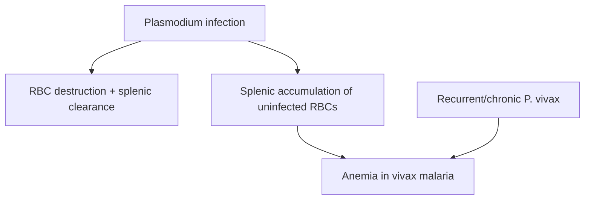

# Anemia

**Therapeutic category:** _Not applicable — anemia is a clinical condition, not a medication._
**Drug group:** _N/A_
**Drug class:** _N/A_
**Controlled substance:** _N/A_

## Overview

Entity classified as `medication` but corpus claims describe anemia as **clinical condition** caused by malaria infection [c:db0a2531] (pending review). No pharmacologic claims present. Note retained in medication template per schema; therapeutic fields marked N/A.

## Indication (Why is this medication prescribed?)

_Not applicable. Anemia is a target condition, not a therapy._ Associated etiologies in corpus:
- [[malaria-infection]] causes anemia [c:db0a2531] (pending review)
- Recurrent/chronic [[plasmodium-vivax]] infection causes anemia in endemic settings [c:12988f90] (pending review)
- [[plasmodium-malariae]] co-occurs with anemia, outpatient endemic setting, Democratic Republic of Congo [c:2fd707b3] (pending review, low certainty)

## Mechanism of Action (How does it work?)

_Not applicable to a condition._ Pathogenesis of malarial anemia per corpus:

Splenic accumulation of uninfected red cells drives anemia in [[vivax-malaria]] [c:b421f4fd][c:d359e581] (pending review). Recurrence/chronicity amplifies effect in endemic settings [c:12988f90] (pending review).

## Dosage and Administration

_No dose claims in current corpus._

## Contraindications (When not to use it)

_No contraindication claims in current corpus._

## Warnings and Precautions

_No warning claims in current corpus._ Clinical signal: anemia frequently co-occurs with [[plasmodium-malariae]] infection in DRC outpatient endemic setting [c:2fd707b3] (pending review, low certainty) — monitor hemoglobin in malaria-endemic populations.

## Side Effects

_Not applicable — anemia is itself a condition, not a drug-induced effect in this corpus._

## Drug Interactions

_No interaction claims in current corpus._

## Storage and Stability

_Not applicable._

---
*Last regenerated: 2026-05-13T18:29:40Z. Source claims: 5. Evidence mix: 5 expert_opinion (all pending review). Entity-type mismatch: classifier labeled `medication` but claim set describes a clinical condition. Recommend reclassification to `condition`/`disease`.*
