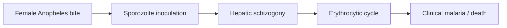

# Anopheles mosquito

**Therapeutic category:** _Not applicable — entity is a disease vector, not a medication._
**Drug group:** _Not applicable._
**Drug class:** _Not applicable._
**Controlled substance:** _Not applicable._

## Overview

*Anopheles* mosquito = arthropod vector of [[plasmodium]] parasites. Female bite transmits [[malaria]] in endemic settings [c:7fc0d7ef]. Field populations show rising insecticide resistance, eroding vector-control programs [c:13a80bce]. Entity misclassified as medication in source corpus — no pharmacologic profile exists. Note retained for schema continuity; clinical actions belong to antimalarials ([[artemether-lumefantrine]], [[primaquine]]) and vector-control tools (ITNs, IRS).

## Indication (Why is this medication prescribed?)

_Not applicable._ *Anopheles* is not prescribed. Relevant clinical context:
- Bite drives [[malaria]] transmission in endemic regions (pending review) [c:7fc0d7ef].

## Mechanism of Action (How does it work?)

Not a drug. Vector mechanism: female *Anopheles* takes blood meal → inoculates *Plasmodium* sporozoites → hepatic then erythrocytic infection → clinical malaria, with mortality burden in endemic settings (pending review) [c:7fc0d7ef].

Cascade load-bearing on [c:7fc0d7ef].

## Dosage and Administration

_No dose claims in current corpus._ Entity is not a therapeutic agent.

## Contraindications (When not to use it)

_Not applicable._ No claims support contraindication semantics for a vector organism.

## Warnings and Precautions

- Insecticide resistance documented in *Anopheles* populations at community level in endemic zones — threatens [[indoor-residual-spraying]] and [[insecticide-treated-nets]] efficacy (pending review, expert_opinion) [c:13a80bce].
- Monitor local resistance phenotype before deploying pyrethroid-only ITNs (inferred from [c:13a80bce]; no direct claim on specific insecticide class).

## Side Effects

_Not applicable to vector._ Clinical sequelae of bite = [[malaria]] morbidity and mortality in endemic settings (pending review) [c:7fc0d7ef].

## Drug Interactions

_Not applicable._ No pharmacokinetic interactions for a vector organism. Vector-control–drug synergies (e.g. ITN + [[artemisinin-combination-therapy]]) not in current claim set.

## Storage and Stability

_Not applicable._

---
*Last regenerated: 2026-05-13T18:30:10Z. Source claims: 2. Evidence mix: 2 expert_opinion (both pending review). Note: entity is a disease vector misclassified as medication — schema fields retained for exporter compatibility; clinical fields intentionally empty to prevent fabrication.*
