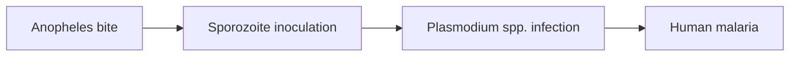

# Anopheles mosquitoes

**Therapeutic category:** Not applicable — disease vector, not therapeutic agent
**Drug group:** Not applicable
**Drug class:** Not applicable
**Controlled substance:** Not applicable

## Overview

Anopheles mosquitoes are the dipteran vectors of human malaria, not a medication. 465 recognised Anopheles species exist, of which ~41 are dominant vectors transmitting *Plasmodium spp.* across 87 endemic countries [c:72fb278e] [c:bbf3cd0d] [c:ac4b29da]. Entry listed under "medication" only because vector-control targets (insecticides) and resistance patterns intersect drug/chemical-class records.

## Indication (Why is this medication prescribed?)

_Not applicable — Anopheles is a vector organism, not a prescribed agent._ Relevant clinical surfaces:
- [[malaria]] transmission across endemic regions [c:ac4b29da]
- Vector control targeting (insecticides, larviciding) [c:02d86a46]

## Mechanism of Action (How does it work?)

Vector biology, not pharmacology. Female Anopheles takes blood meal, ingests gametocytes, sporogony in mosquito, sporozoites injected at next bite — transmits [[plasmodium-spp]] to humans [c:bbf3cd0d] [c:8715ee0c].

[c:8715ee0c] [c:bbf3cd0d]

## Dosage and Administration

_No dose claims in current corpus._ Anopheles is not dosed. Vector-control chemicals (pyrethroids, larvicides) dosed per WHO product guidance — not captured in this claim set.

## Contraindications (When not to use it)

_Not applicable._ No contraindication claims in corpus.

## Warnings and Precautions

- **Insecticide resistance** (endemic settings): Anopheles populations resist insecticides broadly across Africa [c:02d86a46] (pending review, expert_opinion).
- **Pyrethroid resistance** (endemic settings): high-certainty resistance to [[pyrethroid]]-class compounds — undermines [[insecticide-treated-nets]] and IRS programmes [c:2ae924b1] (pending review).
- 41 dominant vector species → control strategy must be locally tailored [c:bbf3cd0d] [c:8715ee0c].

## Side Effects

_Not applicable to vector organism._ Disease burden attributable to bites:
- **Serious / mortality-risk:** [[malaria]] transmission across 87 endemic countries [c:ac4b29da] (meta_analysis, pending review).

## Drug Interactions

_No interaction claims in corpus._ Cross-reference vector-control chemical entries ([[pyrethroid]], larvicides) for resistance-modifying combinations.

## Storage and Stability

_Not applicable._ Vector ecology covered in [[anopheles-ecology]] / climate-transmission notes [c:bbf3cd0d].

---
*Last regenerated: 2026-05-13T18:30:36Z. Source claims: 6. Evidence mix: 1 meta_analysis · 5 expert_opinion. All 6 pending review. Note: entity is a disease vector mis-classified as medication — template fields largely non-applicable; resistance claims surfaced under Warnings.*
