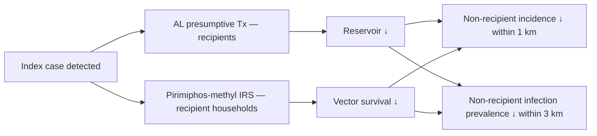

# Artemether-Lumefantrine plus Pirimiphos-Methyl Indoor Residual Spraying

**Therapeutic category:** Combination malaria elimination intervention (reactive focal)
**Drug group:** [[artemisinin-combination-therapy]] + organophosphate [[indoor-residual-spraying]]
**Drug class:** Sesquiterpene endoperoxide + aryl-amino alcohol (oral) co-deployed with organophosphate insecticide (IRS)
**Controlled substance:** No

## Overview

Reactive focal intervention pairing oral [[artemether-lumefantrine]] presumptive treatment with [[pirimiphos-methyl]] indoor residual spraying around index malaria cases. Deployed at community level in endemic [[namibia]] elimination settings to suppress local [[plasmodium-falciparum]] transmission. Effect extends beyond direct recipients via spillover to neighbours within 1–3 km (pending review).

## Indication (Why is this medication prescribed?)

- Reactive focal intervention around index [[malaria]] cases in elimination-phase endemic settings, community care level [c:0670e3b6] [c:c1100831] [c:30139c8a] (pending review).

## Mechanism of Action (How does it work?)

Dual-arm transmission interruption. AL clears bloodstream [[plasmodium-falciparum]] gametocytes/asexual stages in index-area residents; pirimiphos-methyl IRS kills indoor-resting [[anopheles]] vectors. Combined effect shrinks infectious reservoir + vector capacity around index case, producing spillover protection to non-recipients within 1–3 km [c:0670e3b6] [c:c1100831] [c:30139c8a] (pending review, RCT).

[c:0670e3b6]

## Dosage and Administration

_No dose claims in current corpus._ Reactive-focal deployment around index cases in [[namibia]] community setting documented; per-recipient AL mg/kg + IRS coverage radius not specified by claims [c:30139c8a] (pending review).

## Contraindications (When not to use it)

_No contraindication claims in current corpus._

## Warnings and Precautions

_No warning/precaution claims in current corpus._ Standard cautions for component agents ([[artemether-lumefantrine]], [[pirimiphos-methyl]]) apply but not asserted by present claims.

## Side Effects

_No adverse-event claims in current corpus._

## Drug Interactions

_No interaction claims in current corpus._

## Efficacy (spillover, non-recipients)

vs no reactive focal intervention, [[namibia]] community endemic setting, RCT (all pending review):

- Malaria incidence within 1 km of index case: **↓ 43%** (CI 20–59), certainty moderate [c:0670e3b6].
- Infection prevalence within 3 km: **↓ 79%** (CI 6–95), certainty low — wide CI [c:c1100831].
- Seroprevalence within 3 km: **↓ 34%** (CI 20–45), certainty moderate [c:30139c8a].

## Storage and Stability

_No storage claims in current corpus._

---
*Last regenerated: 2026-05-13T18:31:54.595860+00:00. Source claims: 3. Evidence mix: 3 RCT (all pending review).*
