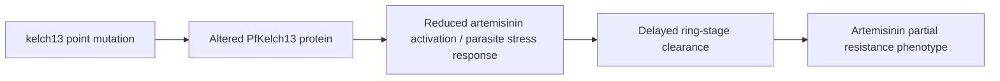

# Artemisinin Partial Resistance

**Therapeutic category:** _Not applicable — resistance phenotype, not a medication._
**Drug group:** _N/A_
**Drug class:** _N/A_
**Controlled substance:** _N/A_

## Overview

Artemisinin partial resistance is a [[plasmodium-falciparum]] phenotype, not a medication. Defined by delayed parasite clearance after [[artemisinin]] exposure. Driven by kelch13 propeller-domain mutations. Emerging in Africa, threatens artemisinin-combination therapy efficacy [c:13f3abd5] (pending review).

## Indication (Why is this medication prescribed?)

_Not applicable. This entity is a resistance phenotype, not a therapeutic agent. Entity classifier hint "medication" is incorrect — should be `condition` or `resistance_phenotype`._

## Mechanism of Action (How does it work?)

Not pharmacologic action. Mechanism = parasite escape from [[artemisinin]] killing via [[kelch13]] propeller-domain point mutations [c:bcfe4261] (pending review). Mutations cause delayed ring-stage clearance in endemic African settings [c:13f3abd5] (pending review).

Both claims expert_opinion grade, same source (PMID:38552654).

## Dosage and Administration

_No dose claims in current corpus._ Not applicable — resistance phenotype has no dose.

## Contraindications (When not to use it)

_Not applicable._

## Warnings and Precautions

- Emergence documented in Africa endemic settings [c:13f3abd5] (pending review). Threatens [[artemisinin-combination-therapy]] backbone.
- Monitor parasite clearance half-life in suspected cases.
- _No claims in corpus on specific monitoring thresholds._

## Side Effects

_Not applicable — phenotype, not drug._

## Drug Interactions

_Not applicable._ Resistance phenotype interacts with [[artemisinin]] exposure (reduces efficacy) but no interaction claims in corpus.

## Storage and Stability

_Not applicable._

---
*Last regenerated: 2026-05-13T18:33:28.772861+00:00. Source claims: 2. Evidence mix: 2 expert_opinion (both pending review, same source PMID:38552654). Entity-type mismatch: classifier tagged `medication` but entity is resistance phenotype — recommend reclassification.*
