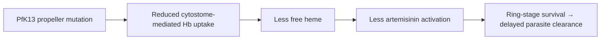

# Artemisinin

**Therapeutic category:** Antimalarial
**Drug group:** Artemisinin and derivatives (ART)
**Drug class:** Sesquiterpene endoperoxide
**Controlled substance:** No

## Overview

Artemisinin = fast-acting antimalarial from *Artemisia annua*. Backbone of [[artemisinin-combination-therapy]] (ACT) for [[uncomplicated-falciparum-malaria]] and [[severe-malaria]]. Note scope: current claim corpus centers on **resistance biology** in *[[plasmodium-falciparum]]*, driven by [[kelch13]] (PfK13) propeller-domain mutations. No pharmacologic dose/contraindication claims present — clinical-use sections flagged accordingly.

## Indication (Why is this medication prescribed?)

- _No indication claims in current corpus._ (Resistance-focused claim set; clinical-indication claims pending ingest.)

## Mechanism of Action (How does it work?)

Artemisinin = pro-drug; endoperoxide bridge cleaved by heme → carbon-centered radicals → alkylate parasite proteins/lipids → kill ring-stage *P. falciparum*. Resistance mechanism dominates current corpus: PfK13 propeller mutations reduce hemoglobin endocytosis at cytostome → less heme-mediated activation → ring-stage survival [c:7c27bae5] (pending review) [c:8ce32b79] (pending review). PfK13 also gates parasite proteostasis stress response, modulating drug-induced damage tolerance [c:8ce32b79] (pending review).

Cite cascade: [c:7c27bae5] (pending review), [c:8ce32b79] (pending review).

## Dosage and Administration

_No dose claims in current corpus._

## Contraindications (When not to use it)

_No contraindication claims in current corpus._

## Warnings and Precautions

- **Resistance surveillance — South-East Asia:** *Pf*Kelch13 **C580Y** validated as causal driver of artemisinin resistance in endemic SE Asia [c:0a432dc1] (pending review). Monitor day-3 parasitemia; do not deploy artemisinin monotherapy.
- **Pan-region K13 propeller mutations:** broader set of PfK13 point mutations (incl. C580Y, R539T, Y493H, I543T) causally linked to artemisinin resistance in *P. falciparum* [c:2b76dfef] (pending review) [c:7c27bae5] (pending review) [c:8ce32b79] (pending review). Genotype suspected treatment failures.
- **Partner-drug failure risk:** ART resistance ↑ selection pressure on ACT partner (e.g. [[lumefantrine]], [[piperaquine]], [[mefloquine]]). Implied by ACT-failure framing [c:2b76dfef] (pending review).

## Side Effects

_No adverse-event claims in current corpus._

## Drug Interactions

_No interaction claims in current corpus._ Partner-drug context: artemisinin always paired in ACT — see [[lumefantrine]], [[amodiaquine]], [[piperaquine]], [[mefloquine]], [[pyronaridine]].

## Storage and Stability

_No storage claims in current corpus._

## Resistance markers (load-bearing)

| Marker | Region | Evidence | Claim |
|---|---|---|---|
| [[kelch13-c580y-mutation]] | South-East Asia, endemic | expert_opinion, high certainty | [c:0a432dc1] (pending review) |
| [[kelch13]] propeller mutations (general) | global | expert_opinion, high certainty | [c:2b76dfef] (pending review) |
| [[kelch13]] mutations (mechanism: cytostome/Hb uptake) | unspecified | expert_opinion, moderate | [c:7c27bae5] (pending review) |
| [[kelch13]] mutations (mechanism: proteostasis) | unspecified | expert_opinion, moderate | [c:8ce32b79] (pending review) |

---
*Last regenerated: 2026-05-13T18:33:46Z. Source claims: 4. Evidence mix: 4 expert_opinion (all pending review). Corpus skewed to resistance biology — dosing/AE/interaction claims absent; do not infer.*
