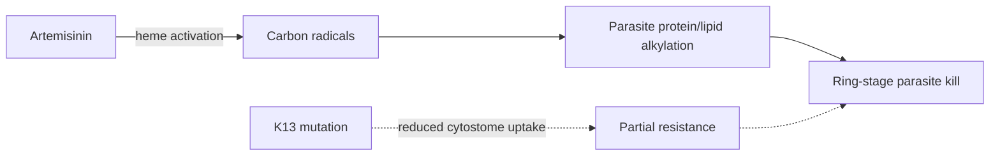

# Artemisinins

**Therapeutic category:** Antimalarial
**Drug group:** Artemisinin and derivatives
**Drug class:** Sesquiterpene endoperoxide
**Controlled substance:** No

## Overview

Artemisinins — fast-acting antimalarials derived from *Artemisia annua*. Backbone of WHO-recommended combination therapy for [[plasmodium-falciparum-malaria]]. Partial resistance now spreading beyond [[greater-mekong-subregion]] into [[eastern-africa]], threatening global malaria control. (pending review)

## Indication (Why is this medication prescribed?)

- Treatment of [[malaria]] [c:107042fb] [c:8b19b278] (pending review)
- Treatment of [[plasmodium-falciparum-malaria]] in endemic settings [c:27565d0d] (pending review)

## Mechanism of Action (How does it work?)

Endoperoxide bridge activated by parasite heme → reactive radicals → alkylation of parasite proteins/lipids → parasite kill. Resistance mechanism load-bearing: [[kelch13]] mutations alter parasite cytostome function, reducing hemoglobin uptake and artemisinin activation [c:107042fb] (pending review).

[c:107042fb]

## Dosage and Administration

_No dose claims in current corpus._ Refer to WHO guidelines and partner-drug specific notes ([[artemether-lumefantrine]], [[artesunate-amodiaquine]], [[dihydroartemisinin-piperaquine]]).

## Contraindications (When not to use it)

_No contraindication claims in current corpus._

## Warnings and Precautions

- **Resistance surveillance load-bearing.** Partial resistance in *P. falciparum* documented across [[greater-mekong-subregion]] [c:a9c5899e] [c:5587f198], broader [[southeast-asia]] [c:a206a584], and emerging in [[eastern-africa]] [c:32d14142] (all pending review).
- Monotherapy must be avoided — use only as [[artemisinin-combination-therapy]] to protect partner drug and slow resistance spread (pending review) [c:27565d0d].
- Monitor day-3 parasitemia in endemic regions as marker of delayed clearance phenotype [c:a9c5899e] (pending review).

## Side Effects

_No side-effect claims in current corpus._

## Drug Interactions

_No interaction claims in current corpus._ Interactions typically driven by partner drug ([[lumefantrine]], [[piperaquine]], [[mefloquine]]) — see partner-drug notes.

## Storage and Stability

_No storage claims in current corpus._

---
*Last regenerated: 2026-05-13T18:34:53.869392+00:00. Source claims: 7. Evidence mix: 7 expert_opinion (all pending review).*
