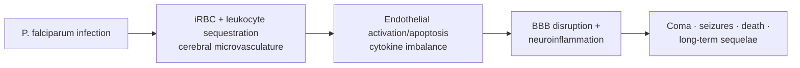

# Cerebral malaria

**Therapeutic category:** _Entity is a clinical syndrome, not a medication. Note rendered against medication template per instruction; treatment agents surfaced below._
**Drug group:** N/A
**Drug class:** N/A
**Controlled substance:** N/A

## Overview

Cerebral malaria = severe non-traumatic encephalopathy complicating [[falciparum-malaria]], defined by coma with [[plasmodium-falciparum]] parasitemia [c:2e32305f][c:88ea4b08][c:51829c73]. High case-fatality (~16.7% in children) and major driver of malaria mortality [c:def21fb4][c:89a27be9]. Survivors risk persistent neurologic, cognitive, behavioral sequelae and [[epilepsy]] [c:57a63a35][c:32918ad2][c:9b9670a1][c:55dc59e2].

## Indication (Why is this medication prescribed?)

_Section repurposed: agents indicated **for** cerebral malaria._

- [[intravenous-artesunate]] — recommended first-line for cerebral malaria, inpatient [c:ffb5b275][c:1d02dadc]
- [[intravenous-quinine]] — drip infusion, inpatient [c:aebbd8f1]
- [[artemisinin-derivatives]] — vs established antimalarials [c:0fd1123e]
- Generic [[antimalarial-drugs]] [c:cda0e26d]
- Standardized antimalarial treatment pathway (pediatric, inpatient, endemic) [c:55f6021e]

## Mechanism of Action (How does it work?)

_Mechanism = pathogenesis of the syndrome, not drug MoA._ [[plasmodium-falciparum]] infection drives sequestration of parasitized RBCs in cerebral microvasculature, leukocyte sequestration, endothelial activation/apoptosis, cytokine imbalance, [[blood-brain-barrier]] disruption, neuroinflammation, reduced [[nitric-oxide]] bioavailability, platelet activation [c:a7ec1ecb][c:a6870dfa][c:768bc4fe][c:e26185c3][c:dd9cf2ce][c:99448174][c:992035a4][c:b3e62607][c:68f3b561][c:704d32a9][c:e402ac3d][c:98e27cc3][c:496787c6].

Load-bearing: [c:e26185c3][c:dd9cf2ce][c:68f3b561][c:e402ac3d][c:4d836005]

## Dosage and Administration

_No dose claims in current corpus._ Only route/frequency cues: quinine = IV drip infusion [c:aebbd8f1]; artesunate = IV [c:ffb5b275][c:1d02dadc]. No mg/kg, duration, pediatric/adult/pregnancy/renal-adjusted dosing in claim set.

## Contraindications (When not to use it)

_No contraindication claims in current corpus._

## Warnings and Precautions

Manage as inpatient — multisystem dysfunction frequent [c:a1f2f0e3]. Monitor for:
- [[renal-failure]] (co-occurs) [c:fda714de]
- [[metabolic-acidosis]] (co-occurs) [c:5f3ba066]
- Acute seizures, pediatric [c:2a0e347e]
- Disturbed consciousness / coma [c:a08338a4][c:51829c73]
- Mortality risk substantial; pediatric CFR ~16.7% [c:def21fb4][c:4d836005][c:89a27be9]

## Side Effects

_Reframed: sequelae of the syndrome itself._

**Serious / mortality risk:**
- Coma, death [c:4d836005][c:def21fb4]
- Multisystem dysfunction (renal failure, acidosis comorbid) [c:a1f2f0e3]

**Common (acute):**
- Seizures (pediatric) [c:2a0e347e]
- Disturbed consciousness [c:a08338a4]

**Post-acute / long-term:**
- Neurological sequelae [c:ee767e54][c:55dc59e2]
- Persistent neurologic deficits (pediatric) [c:57a63a35]
- Neurologic, cognitive, behavioral sequelae (pediatric) [c:32918ad2]
- [[epilepsy]] (pediatric, outpatient follow-up) [c:9b9670a1]

## Drug Interactions

_No drug-interaction claims in current corpus._

## Storage and Stability

_Not applicable — entity is condition, not drug product._

---
*Last regenerated: 2026-05-13T18:37:29Z. Source claims: 35. Evidence mix: 35 expert_opinion (all pending review). Entity-type mismatch: classifier said `medication`, content is disease syndrome — treatment agents surfaced in Indication section.*
