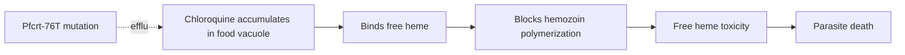

# Chloroquine

**Therapeutic category:** Antimalarial
**Drug group:** Blood schizonticide
**Drug class:** 4-aminoquinoline
**Controlled substance:** No

## Overview

Chloroquine is a 4-aminoquinoline blood schizonticide used to treat malaria caused by chloroquine-susceptible *Plasmodium* species. Once first-line for all malaria, widespread *P. falciparum* and emerging *P. vivax* resistance has narrowed its role to non-falciparum infections and falciparum acquired in the few remaining susceptible regions [c:4bb4d94c][c:2838d6b7].

## Indication (Why is this medication prescribed?)

- Uncomplicated [[plasmodium-vivax-malaria]] in susceptible regions (e.g. India) [c:a574a405][c:16488a65]; treats acute attack only — does not eradicate hypnozoites [c:5cfefffb]
- Uncomplicated [[plasmodium-ovale-malaria]] [c:73349825]
- Uncomplicated [[plasmodium-malariae-malaria]] [c:a98cab66]
- Uncomplicated [[plasmodium-knowlesi-malaria]] (adults + pediatric >10 kg, Sabah Malaysia) [c:fa858e31][c:e8b8fae6]
- Imported non-falciparum malaria, UK/Netherlands travelers, alternative to oral ACT [c:8589e315][c:7a717d9a][c:450dc5d1][c:16c76ec4]
- [[plasmodium-falciparum-malaria]] acquired in chloroquine-sensitive region (e.g. Haiti) [c:14df4dc2][c:4a7a09a5] *(pending review)*
- Chemoprophylaxis of [[malaria-in-pregnancy]] (2nd/3rd trimester, endemic setting) — low certainty [c:cd05f44f] *(pending review)*

## Mechanism of Action (How does it work?)

Concentrates in parasite digestive vacuole; blocks heme polymerization into hemozoin → toxic free heme accumulates → parasite death. Resistance load-bearing on [[pfcrt]] transporter mutations (e.g. Pfcrt-76T allele, 25% frequency northern Nigeria) [c:6e6b1791][c:df448236].

Resistance mechanism cited [c:6e6b1791][c:df448236].

## Dosage and Administration

| Indication | Population | Dose | Source |
|---|---|---|---|
| Uncomplicated *P. knowlesi* | Adults + peds >10 kg | 25 mg/kg total course, oral | [c:fa858e31] |
| All other indications | — | _No dose claims in current corpus._ | — |

## Contraindications (When not to use it)

- Suspected [[plasmodium-knowlesi]] in *P. vivax*/*P. falciparum* co-endemic Southeast Asia — misidentification risk under microscopy [c:4a9c1b75] *(pending review)*
- Misdiagnosed drug-resistant *P. vivax* or *P. falciparum* infection, Southeast Asia [c:74e82399] *(pending review)*
- Chloroquine-resistant *P. falciparum* (most regions worldwide including Africa) [c:4bb4d94c][c:cf799429][c:df448236]
- Chloroquine-resistant *P. vivax* zones [c:2838d6b7][c:aa6e0356]

## Warnings and Precautions

- Confirm species + regional susceptibility before use — empiric chloroquine fails in resistant *P. falciparum* zones [c:4bb4d94c][c:df448236]
- *P. knowlesi* microscopy confounded with *P. malariae*/*P. falciparum*; co-endemic SE Asia areas should default to ACT [c:4a9c1b75][c:74e82399] *(pending review)*
- Northern Nigeria Pfcrt-76T frequency 25% → residual resistance persists despite policy withdrawal [c:6e6b1791] *(pending review)*
- Pregnancy use limited to chemoprophylaxis context, low-certainty data [c:cd05f44f] *(pending review)*

## Side Effects

_No adverse-event claims in current corpus._

## Drug Interactions

_No interaction claims in current corpus._ Comparator-only references to [[artemisinin-based-combination-therapy]] / [[artemether-lumefantrine]] / oral ACT exist as therapeutic alternatives, not interactions [c:fa858e31][c:f73d8d7f][c:8589e315].

## Storage and Stability

_No storage claims in current corpus._

---
*Last regenerated: 2026-05-13T18:40:01Z. Source claims: 24. Evidence mix: 1 RCT · 23 expert_opinion.*
