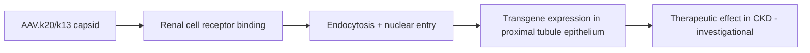

# AAV.k20 / AAV.k13 (engineered kidney-tropic AAV capsids)

**Therapeutic category:** Investigational gene therapy vector
**Drug group:** Adeno-associated virus (AAV) capsid library derivative
**Drug class:** Engineered AAV capsid (cross-species cycling)
**Controlled substance:** No

## Overview

AAV.k20 and AAV.k13 are engineered AAV capsids from cross-species capsid-library cycling, selected for kidney tropism. Preclinical candidates for gene transfer to renal tissue in [[chronic-kidney-disease]]. Outperform parental AAV9 on kidney-specific transduction metrics. Not approved; no human dosing established. (pending review)

## Indication (Why is this medication prescribed?)

- Investigational gene transfer to kidney in [[chronic-kidney-disease]] — preclinical only [c:c9222e47] [c:6abbaaf5]

## Mechanism of Action (How does it work?)

Engineered capsids bind renal cell surface receptors with higher affinity than [[aav9]], enabling vector entry and transgene delivery to kidney parenchyma. AAV.k20 enriches kidney transduction efficiency vs AAV9 [c:c9222e47]. AAV.k13 drives transgene expression in [[proximal-tubule-epithelial-cells]] vs AAV9 [c:6abbaaf5].

Mechanism load-bearing claims [c:c9222e47] [c:6abbaaf5].

## Dosage and Administration

_No dose claims in current corpus._ Route signal only: ureteral delivery reported for AAV.k20 [c:c9222e47]. No mg/kg, frequency, or duration established (pending review).

## Contraindications (When not to use it)

_No contraindication claims in current corpus._

## Warnings and Precautions

_No warning claims in current corpus._ Investigational agent; not for clinical use outside trial protocol.

## Side Effects

_No adverse-event claims in current corpus._

## Drug Interactions

_No interaction claims in current corpus._

## Storage and Stability

_No storage claims in current corpus._

---
*Last regenerated: 2026-05-13T18:40:49.977935+00:00. Source claims: 2. Evidence mix: 2 expert_opinion (both pending review).*
