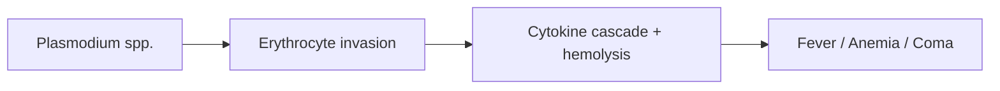

# Clinical malaria disease

**Therapeutic category:** _Not a medication — entity is a disease state._
**Drug group:** _N/A_
**Drug class:** _N/A_
**Controlled substance:** _N/A_

## Overview

Entity mis-routed to medication template. "Clinical malaria disease" denotes symptomatic infection (fever, anemia, coma) caused by Plasmodium spp., not a therapeutic agent. Current claim corpus contains only etiologic relations naming causative parasites. No pharmacologic claims present.

## Indication (Why is this medication prescribed?)

_No medication claims in current corpus._ Entity is a disease, not a drug. For treatment agents, see [[artemether-lumefantrine]], [[artesunate]], [[chloroquine]], [[primaquine]].

## Mechanism of Action (How does it work?)

_No mechanism-of-drug claims._ Disease caused by erythrocytic-stage infection with:

- [[plasmodium-falciparum]] → fever, anemia, coma [c:b63de3da] (pending review)
- [[plasmodium-vivax]] → fever, anemia, coma [c:88250477] [c:52321cce] (pending review)
- [[plasmodium-knowlesi]] [c:f129bcbe] (pending review)
- [[plasmodium-malariae]] [c:f67b0e2b] (pending review)
- [[plasmodium-ovale-curtisi]] [c:b264f3cc] (pending review)
- [[plasmodium-ovale-wallickeri]] [c:16a1b885] (pending review)

All evidence_grade: expert_opinion (PMID:28533315).

Cascade inferred from etiologic claims [c:b63de3da] [c:88250477]; downstream steps not directly claim-backed.

## Dosage and Administration

_No dose claims in current corpus._ Hard-stop: dose safety prevents invention.

## Contraindications (When not to use it)

_No medication claims in current corpus._

## Warnings and Precautions

_No medication claims in current corpus._ Disease itself carries mortality risk via [[cerebral-malaria]] (coma) and severe anemia [c:b63de3da] [c:88250477] (pending review).

## Side Effects

_No medication claims in current corpus._

## Drug Interactions

_No medication claims in current corpus._

## Storage and Stability

_N/A — disease entity._

---
*Last regenerated: 2026-05-13T18:41:53Z. Source claims: 7. Evidence mix: 7 expert_opinion (all pending review). Note: entity classifier mis-assigned; re-route to disease template recommended.*
