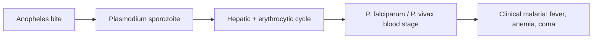

# Clinical malaria

**Therapeutic category:** N/A — entity is disease outcome, not drug
**Drug group:** N/A
**Drug class:** N/A
**Controlled substance:** N/A

## Overview

Clinical malaria = symptomatic [[plasmodium]] infection (fever, anemia, coma) caused by [[plasmodium-falciparum]] [c:c349e9ee] and [[plasmodium-vivax]] [c:0a98f134]. Entity classified as medication in source hint but corpus claims describe **preventive interventions against** clinical malaria, not a drug. Note below catalogs intervention claims rather than pharmacology of single agent.

## Indication (Why is this medication prescribed?)

N/A — outcome variable. Prevention claims surfaced below target this outcome:
- [[r21-matrix-m]] vaccine, children 5–36 months, sub-Saharan Africa [c:d9883f8e] _(pending review)_
- [[rts-s-vaccine]] (Mosquirix), pediatric endemic [c:eb8560c1] _(pending review)_
- [[permethrin]]-treated baby wraps, infants 6–18 months, Uganda [c:193a60dc] _(pending review)_
- [[dihydroartemisinin-piperaquine]] IPTp, 2nd/3rd trimester pregnancy [c:da7c19da] _(pending review)_

## Mechanism of Action (How does it work?)

Disease entity — no MoA. Causal pathway:

P. falciparum drives severe phenotype [c:c349e9ee]; P. vivax also causes clinical disease [c:0a98f134]. Repeated natural infection in semi-immune adults reduces clinical episodes [c:12134f40] _(pending review)_.

## Dosage and Administration

_No dose claims in current corpus for clinical malaria as drug._

Regimen qualifiers from prevention claims (intervention, not drug-for-disease):
| Intervention | Population | Regimen | Source |
|---|---|---|---|
| R21/Matrix-M | 5–36 mo, endemic | 3 doses + booster, 12 mo follow-up | [c:d9883f8e] |
| Permethrin baby wrap | 6–18 mo, Uganda | retreat q4 weeks × 24 weeks | [c:193a60dc] |
| DHA-piperaquine IPTp | pregnancy 2nd/3rd trimester | frequency not specified | [c:da7c19da] |
| RTS,S | pediatric endemic | not specified | [c:eb8560c1] |

## Contraindications (When not to use it)

N/A — disease entity. _No contraindication claims in current corpus._

## Warnings and Precautions

N/A. _No warning claims in current corpus._ Severe phenotypes (coma, anemia) mortality-relevant [c:c349e9ee].

## Side Effects

N/A — disease, not drug. Clinical features = fever, anemia, coma [c:c349e9ee].

## Drug Interactions

_No interaction claims in current corpus._

Comparator data:
- DHA-piperaquine vs [[sulphadoxine-pyrimethamine]] IPTp, pregnancy [c:da7c19da] (meta-analysis, OR unreported)
- R21/Matrix-M vs rabies vaccine: 868 cases averted/1000 child-yrs (CI 762–974), seasonal sites [c:d9883f8e]
- Permethrin wrap + LLIN vs sham wrap + LLIN: IRR 0.34 (CI 0.23–0.51) [c:193a60dc]

## Storage and Stability

N/A. _No storage claims in current corpus._

---

**Entity classification warning:** Source labeled `clinical malaria` as `medication`. Corpus claims indicate disease/outcome entity. Recommend reclassification to `condition` or `outcome`. Medication template fields filled with N/A where no drug exists.

---
*Last regenerated: 2026-05-13T18:41:08Z. Source claims: 7. Evidence mix: 2 RCT · 1 meta_analysis · 4 expert_opinion. All claims pending_review.*
