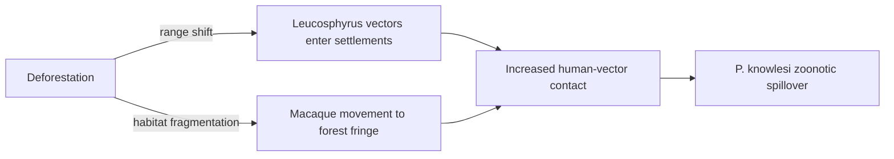

# Deforestation

**Therapeutic category:** N/A — not a medication (environmental/land-use driver)
**Drug group:** N/A
**Drug class:** N/A
**Controlled substance:** N/A

## Overview

Deforestation is not a therapeutic agent. Entity classifier flagged it as `medication`, but current claim corpus describes it as an ecological driver of zoonotic malaria emergence in Southeast Asia — increasing human–vector–macaque contact at forest fringes [c:56f9051a] [c:8c95f5ac]. Note retained under medication template for exporter parity; pharmacological sections intentionally empty.

## Indication (Why is this medication prescribed?)

_Not applicable — deforestation is not prescribed._ Epidemiological relevance instead:

- Driver of [[plasmodium-knowlesi]] zoonotic emergence in [[southeast-asia]], endemic settings (low certainty, expert opinion) [c:8c95f5ac] (pending review)
- Driver of increased human exposure to [[p-knowlesi]] vector mosquitoes, community setting (pending review) [c:15227b34]

## Mechanism of Action (How does it work?)

Land-use mechanism, not pharmacological. Forest clearance pushes simian-malaria vectors and macaque reservoirs into farms, plantations, and settlements [c:56f9051a], expanding [[anopheles-leucosphyrus-group]] vector range into human habitation [c:a89c2532] (pending review).

Cascade load-bearing: [c:56f9051a] [c:a89c2532] [c:8c95f5ac].

## Dosage and Administration

_No dose claims in current corpus._ Not applicable — deforestation is not administered.

## Contraindications (When not to use it)

_No contraindication claims in current corpus._ Not applicable.

## Warnings and Precautions

_No pharmacological warnings._ Public-health signal only:

- Forest-fringe agricultural workers, plantation labour, and forest-edge settlements in [[southeast-asia]] have elevated [[plasmodium-knowlesi]] exposure risk under deforestation pressure [c:15227b34] [c:a89c2532] (pending review)

## Side Effects

_No drug side-effect claims._ Ecological consequence claims:

- **Serious (population-level):**
  - Vector and macaque incursion into farms, plantations, settlements — endemic Southeast Asia [c:56f9051a] (pending review)
  - [[anopheles-leucosphyrus-group]] range expansion into human settlements [c:a89c2532] (pending review)
  - Zoonotic [[plasmodium-knowlesi]] emergence — low certainty [c:8c95f5ac] (pending review)

## Drug Interactions

_No drug-interaction claims._ Not applicable.

## Storage and Stability

_Not applicable._

---
*Last regenerated: 2026-05-13T18:45:10.734809+00:00. Source claims: 4. Evidence mix: 4 expert_opinion. Entity-type mismatch: classifier labelled `medication`; corpus describes ecological driver — recommend reclassify to `exposure` or `environmental-factor`.*
