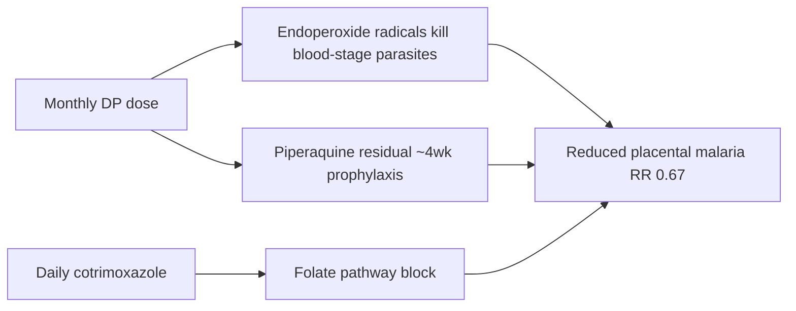

# Dihydroartemisinin-piperaquine plus cotrimoxazole

**Therapeutic category:** Antimalarial + antifolate antibiotic (combined regimen)
**Drug group:** Artemisinin combination therapy + sulfonamide/trimethoprim prophylaxis
**Drug class:** Sesquiterpene endoperoxide ([[dihydroartemisinin]]) + bisquinoline ([[piperaquine]]) + dihydrofolate/dihydropteroate synthesis inhibitor ([[cotrimoxazole]])
**Controlled substance:** No

## Overview

Combination regimen pairing monthly [[dihydroartemisinin-piperaquine]] (DP) with daily [[cotrimoxazole]] for intermittent preventive treatment of malaria in pregnancy (IPTp) among HIV-positive pregnant women in sub-Saharan Africa. Cotrimoxazole baseline = standard HIV opportunistic-infection prophylaxis; DP layered on top for malaria prevention [c:747232dc].

## Indication (Why is this medication prescribed?)

- IPTp in HIV-positive pregnant women, second/third trimester, sub-Saharan Africa (pending review) [c:747232dc]
- Prevention of [[placental-malaria]] (histopathology-confirmed) vs daily cotrimoxazole alone [c:a78dfd13]

## Mechanism of Action (How does it work?)

[[dihydroartemisinin]] generate free radicals via endoperoxide cleavage → kill blood-stage [[plasmodium-falciparum]]. [[piperaquine]] long half-life → post-treatment prophylactic cover ~4 weeks. [[cotrimoxazole]] block parasite folate synthesis + cover bacterial opportunistic infections in HIV. Layered effect = monthly antimalarial pulse + daily antifolate backstop.

[c:a78dfd13]

## Dosage and Administration

_No mg/kg, frequency, or duration claims in current corpus._ Claims cite regimen as "[[dihydroartemisinin-piperaquine]] + daily [[cotrimoxazole]]" without numeric dosing [c:747232dc][c:a78dfd13]. Refer WHO IPTp guidance before prescribing.

## Contraindications (When not to use it)

_No contraindication claims in current corpus._

## Warnings and Precautions

_No warning claims in current corpus._ Standard caveats for DP (QT prolongation) and cotrimoxazole (sulfa hypersensitivity, hyperkalemia, marrow suppression) not yet sourced.

## Side Effects

_No adverse-event claims in current corpus._

## Drug Interactions

_No interaction claims in current corpus._ Note: DP + cotrimoxazole co-administration itself is the indicated regimen, not an interaction warning [c:747232dc].

## Storage and Stability

_No storage claims in current corpus._

## Efficacy (load-bearing)

- Placental malaria (histopathology): RR **0.67** (95% CI 0.5–0.9) vs daily cotrimoxazole alone; meta-analysis, high certainty (pending review) [c:a78dfd13]
- Recommended over [[mefloquine]] + cotrimoxazole comparator for IPTp in HIV+ pregnancy; moderate certainty (pending review) [c:747232dc]

---
*Last regenerated: 2026-05-13T18:46:58Z. Source claims: 2. Evidence mix: 2 meta_analysis (both pending review, same source PMID:39324693).*
