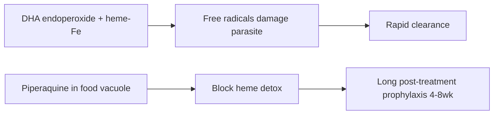

# Dihydroartemisinin-piperaquine

**Therapeutic category:** Antimalarial
**Drug group:** Artemisinin-based combination therapy (ACT)
**Drug class:** Sesquiterpene endoperoxide (DHA) + bisquinoline (piperaquine)
**Controlled substance:** No

## Overview

Fixed-dose ACT pairing dihydroartemisinin (fast-acting artemisinin derivative) with piperaquine (long half-life partner). Used to treat [[uncomplicated-falciparum-malaria]] [c:6977829a][c:a1a99f4e] and increasingly studied for chemoprevention in [[pregnancy]] [c:96a0b0f2] and [[young-children]] [c:936d54b1]. Long piperaquine half-life enables monthly prevention dosing.

## Indication (Why is this medication prescribed?)

- Treatment of uncomplicated [[plasmodium-falciparum]] malaria in adults and children, including imported cases in non-endemic UK settings vs [[artemether-lumefantrine]] [c:341a5985][c:e4817873][c:a09cab84][c:d6c1a9b9][c:d4a15e50][c:50457c54][c:38777ddb] (expert_opinion); endemic Indonesia [c:6977829a] (RCT); South East Asia [c:a1a99f4e] (meta_analysis).
- [[Intermittent-preventive-treatment-in-pregnancy]] (IPTp) — monthly DP superior to [[sulfadoxine-pyrimethamine]] for preventing symptomatic malaria (IRR 0.06, 95% CI 0.03–0.12) [c:96a0b0f2][c:7d0210ab] and microscopic parasitemia (RR 0.03, 95% CI 0.02–0.05) [c:fa000ae8] (RCT, Uganda); also prevents [[placental-malaria]] [c:51a6e01a] and clinical malaria [c:da7c19da] (meta_analysis); supersedes SP in pregnancy prevention [c:7847a000].
- Prevention of [[adverse-pregnancy-outcomes]] from malaria in Africa [c:60506afe][c:4656c19d][c:0e95ee8c][c:595047a3][c:ebd111a8] (pending review).
- Chemoprevention in young children 2–24 months — every-4-week dosing protective efficacy 95% (84–99%) vs 12-weekly [c:936d54b1] (RCT); infant prevention 8 weeks–2 years [c:4b9fdfb6]; [[seasonal-malaria-chemoprevention]] [c:5e26c9a9].
- [[Post-discharge-malaria-chemoprevention]] after severe anaemia in children, Kenya/Uganda [c:41c754ae] (meta_analysis).
- Focal mass drug administration for elimination, [[greater-mekong-subregion]] [c:aecdb983][c:20465445] (pending review).

## Mechanism of Action (How does it work?)

DHA component generates carbon-centred radicals via heme-iron activation of endoperoxide bridge → damages parasite proteins/membranes → rapid parasite clearance. Piperaquine, bisquinoline, accumulates in parasite food vacuole → inhibits heme detoxification → long post-treatment prophylaxis. PK target: piperaquine venous plasma concentration ≥13.9 ng/mL gives 99% protection vs Pf infection in pregnancy [c:1bb9d163][c:75541c7f] (RCT).

Cite: [c:1bb9d163][c:75541c7f]

## Dosage and Administration

| Indication | Population | Regimen |
|---|---|---|
| IPTp prevention | Adults, 2nd/3rd trimester, HIV-uninfected | Piperaquine target ≥13.9 ng/mL; q4w or q8w from 12–20 wk gestation to delivery [c:1bb9d163][c:75541c7f][c:ebd111a8] |
| IPTp prevention | Pregnant, sub-Saharan Africa | Monthly DP [c:96a0b0f2][c:7d0210ab][c:fa000ae8][c:51a6e01a][c:7847a000] |
| Child chemoprevention | 2–24 months, Uganda | Every 4 weeks (superior to q12w) [c:936d54b1] |
| Infant chemoprevention | 8 wk–2 yr | Every 12 weeks [c:4b9fdfb6] |
| Treatment uncomplicated Pf | Adults/peds | Per-claim mg/kg not specified [c:341a5985][c:6977829a][c:a09cab84] |

_No mg/kg dose claims in current corpus — refer to product label (Eurartesim) [c:50457c54]._

## Contraindications

_No contraindication claims in current corpus._

## Warnings and Precautions

_No explicit warning claims in current corpus._ Clinical caution: known piperaquine QT-interval risk warrants ECG monitoring in label — not covered by current claim set.

## Side Effects

_No adverse-event claims in current corpus._

## Drug Interactions

- Combined with [[sulfadoxine-pyrimethamine]] in IPTp — DP+SP phase 3 trial Uganda evaluated additive prevention vs either alone [c:96a0b0f2][c:fa000ae8][c:7d0210ab].
- Comparator (not interaction) vs [[artemether-lumefantrine]] for treatment [c:341a5985][c:e4817873][c:a09cab84][c:50457c54].

_No pharmacokinetic interaction claims in current corpus._

## Storage and Stability

_No storage claims in current corpus._

---
*Last regenerated: 2026-05-13T18:46:08Z. Source claims: 28. Evidence mix: 7 RCT · 4 meta_analysis · 17 expert_opinion.*
