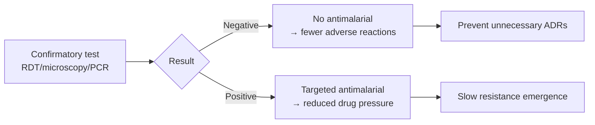

# Early Accurate Malaria Diagnosis

**Therapeutic category:** Diagnostic strategy (not a medication)
**Drug group:** N/A — entity misclassified as medication
**Drug class:** N/A
**Controlled substance:** N/A

## Overview

"Early accurate malaria diagnosis" is diagnostic strategy, not drug. Refers to prompt confirmatory testing (RDT, microscopy, PCR) before antimalarial use, vs presumptive treatment. Pediatric claims in current corpus tie strategy to two stewardship outcomes: fewer needless drug exposures and slower resistance emergence in endemic settings [c:efc5aa9a][c:00972ef4]. Note: entity type flagged `medication` upstream but no drug substance — downstream sections largely non-applicable.

## Indication (Why is this medication prescribed?)

- Confirmation of suspected [[malaria]] in pediatric patients before starting antimalarials [c:efc5aa9a] _(pending review)_
- Antimalarial stewardship in [[endemic-malaria-settings]] to slow resistance [c:00972ef4] _(pending review)_

## Mechanism of Action (How does it work?)

Not a pharmacologic agent. Operates upstream of prescribing: confirmatory test result gates antimalarial initiation, vs [[presumptive-diagnosis]] comparator. Two claimed downstream effects:

Evidence grade: expert_opinion for both pathways [c:efc5aa9a][c:00972ef4].

## Dosage and Administration

_No dose claims in current corpus._ Entity is not a drug — dosing not applicable.

## Contraindications (When not to use it)

_No contraindication claims in current corpus._

## Warnings and Precautions

- Entity classified as `medication` upstream but is a diagnostic/clinical strategy — reclassify before exporting to Master-sheet Medications tab.
- All supporting claims `expert_opinion` grade, `pending_review` status — do not promote to clinical guidance without higher-grade evidence.

## Side Effects

Not applicable — no pharmacologic exposure. Indirect benefit claimed: reduction in adverse reactions to antimalarials when diagnosis negative [c:efc5aa9a] _(pending review)_.

## Drug Interactions

Not applicable. Upstream of any drug — no PK/PD interaction surface.

## Storage and Stability

Not applicable to a diagnostic strategy. Storage requirements apply to constituent test kits (RDTs, stains, PCR reagents), not to the strategy itself — out of scope here.

---
*Last regenerated: 2026-05-13T18:48:09.776391+00:00. Source claims: 2. Evidence mix: 2 expert_opinion (both pending review). Flag: entity-type mismatch — recommend reclassify to `diagnostic_strategy` or `clinical_practice`.*
