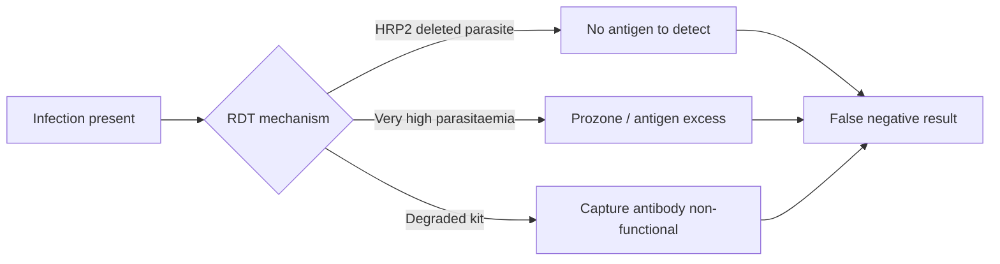

# False Negative Malaria RDT Result

**Therapeutic category:** Not applicable — diagnostic artifact, not a medication
**Drug group:** N/A
**Drug class:** N/A
**Controlled substance:** N/A

## Overview

Not a medication. Entity is diagnostic failure mode of [[malaria-rapid-diagnostic-test]] where test reads negative despite active *Plasmodium* infection. Note retained in medication schema for exporter compatibility; clinical content limited to causes of failure surfaced by current claims.

## Indication (Why is this medication prescribed?)

_Not applicable — not a therapeutic agent._

## Mechanism of Action (How does it work?)

Causes of false negative result in endemic settings (pending review):

- [[plasmodium-falciparum-hrp2-gene-deletion]] — parasite lacks HRP2 antigen target, RDT antibody fails to bind [c:8f9bbc2e] (expert_opinion, moderate certainty).
- [[prozone-effect]] — antigen excess at very high parasitaemia saturates antibodies, blocks lattice formation, suppresses test line [c:8b524202] (expert_opinion, moderate certainty).
- [[faulty-rdt-kits]] — manufacturing defect, cold-chain breach, or expiry degrades capture antibody [c:5b620a42] (expert_opinion, low certainty).

[c:8f9bbc2e] [c:8b524202] [c:5b620a42]

## Dosage and Administration

_No dose claims in current corpus._ Not applicable — diagnostic failure mode.

## Contraindications (When not to use it)

_Not applicable._ Operationally: do not rely on single negative RDT in endemic setting when clinical suspicion remains high — escalate to [[microscopy]] or [[malaria-pcr]] (pending review — no claim in corpus yet).

## Warnings and Precautions

- Endemic-setting negative RDT does not exclude malaria when HRP2-deletion strains circulate [c:8f9bbc2e] (pending review).
- Hyperparasitaemic patients may RDT-negative via prozone; repeat with diluted sample or alternative target [c:8b524202] (pending review).
- Verify kit lot, expiry, storage temperature before trusting negative result [c:5b620a42] (pending review).

## Side Effects

_Not applicable — diagnostic artifact, no pharmacologic side-effect profile._

Downstream clinical risk: missed diagnosis → delayed antimalarial → progression to [[severe-malaria]] and mortality. No claim in current corpus quantifies this — flagged as inference gap.

## Drug Interactions

_Not applicable._

## Storage and Stability

Kit-level only: RDT cassettes degrade with heat and humidity exposure; faulty/expired kits drive false negatives [c:5b620a42] (pending review). Specific temperature/humidity thresholds not in current claims.

---
*Last regenerated: 2026-05-13T18:49:20Z. Source claims: 3. Evidence mix: 3 expert_opinion (all pending review). Entity-type mismatch: classifier tagged `medication` but subject is diagnostic failure mode — recommend reclassification to `diagnostic_finding`.*
