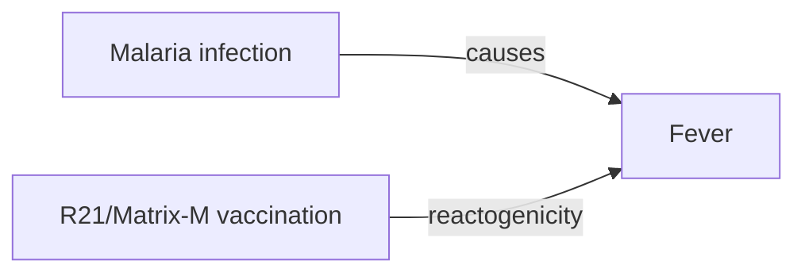

# Fever

**Therapeutic category:** _Not applicable — entity is a clinical sign, not a medication._
**Drug group:** _N/A_
**Drug class:** _N/A_
**Controlled substance:** _N/A_

## Overview

Fever is a symptom, not a therapeutic agent. Current claim corpus describes fever as a clinical manifestation of [[malaria]] infection [c:a5fe6db3] [c:984cfa60] (pending review) and as a reactogenicity event after [[r21-matrix-m]] malaria vaccination in young children [c:ea78f724] (pending review). No claims position fever as a drug; this note preserves the master-sheet shape but flags the type mismatch.

## Indication (Why is this medication prescribed?)

_No indication claims in current corpus — fever is not a prescribable agent._

## Mechanism of Action (How does it work?)

_No mechanism-of-action claims for fever as an agent._ Mechanistically, claims describe fever as a downstream effect:

- [[malaria]] infection → fever [c:a5fe6db3] (expert_opinion, pending review)
- [[malaria]] in endemic setting → fever [c:984cfa60] (expert_opinion, pending review)
- [[r21-matrix-m]] vaccination → fever in children 5–36 months, sub-Saharan Africa [c:ea78f724] (RCT, pending review)

## Dosage and Administration

_No dose claims in current corpus._ Fever is not dosed.

## Contraindications (When not to use it)

_No contraindication claims in current corpus._

## Warnings and Precautions

- Fever observed in 46.7% of recipients (vs rabies-vaccine comparator) after [[r21-matrix-m]] 3-dose + booster schedule, outpatient, age 5–36 months, sub-Saharan Africa [c:ea78f724] (RCT, pending review). Treat as expected reactogenicity, not as drug warning.
- Fever in endemic regions warrants [[malaria]] workup [c:984cfa60] (pending review).

## Side Effects

_Not applicable — fever is itself an effect, not an agent with side effects._ Reverse-mapped associations:

- **Common (post-vaccination):** fever after [[r21-matrix-m]], ~46.7% proportion [c:ea78f724].
- **Disease-associated:** fever as cardinal feature of [[malaria]] [c:a5fe6db3] [c:984cfa60].

## Drug Interactions

_No interaction claims in current corpus._

## Storage and Stability

_Not applicable._

---
*Last regenerated: 2026-05-13T18:51:05Z. Source claims: 3. Evidence mix: 1 RCT · 2 expert_opinion. **Type mismatch flag:** entity "fever" classified as `medication` but is a symptom/sign; all 3 claims have fever as object, not subject. Recommend reclassification to `symptom` or `clinical-finding`.*
