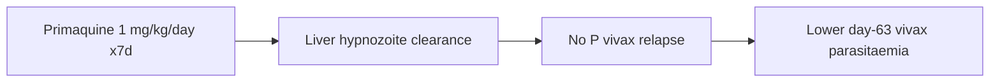

# High-dose short-course primaquine

**Therapeutic category:** Antimalarial
**Drug group:** 8-aminoquinoline
**Drug class:** 8-aminoquinoline
**Controlled substance:** No

## Overview

High-dose short-course primaquine = 7 mg/kg total split daily over 7 days (1 mg/kg/day). Given after [[falciparum-malaria]] treatment in co-endemic regions to prevent later [[vivax-malaria]] parasitaemia from undetected hypnozoites. Requires G6PD screening before use (pending review).

## Indication (Why is this medication prescribed?)

- Prevention of subsequent [[vivax-malaria]] parasitaemia after [[falciparum-malaria]] in P falciparum/P vivax co-endemic regions (Bangladesh, Indonesia, Ethiopia) [c:9df20651] (pending review).

## Mechanism of Action (How does it work?)

8-aminoquinoline. Clears [[plasmodium-vivax]] hypnozoites in liver — radical cure. Trial used 7-day regimen to prevent day-63 vivax parasitaemia after falciparum episode [c:9df20651] (pending review).

[c:9df20651]

## Dosage and Administration

| Indication | Population | Dose | Route | Frequency | Duration |
|---|---|---|---|---|---|
| Prevent post-falciparum [[vivax-malaria]] | ≥1 yr (Bangladesh, Indonesia); ≥18 yr (Ethiopia); G6PD ≥70%; outpatient | 1 mg/kg/day (7 mg/kg total) | — | daily | 7 days |

[c:7ae755f6][c:9df20651] (pending review, RCT). No pediatric <1 yr, pregnancy, or renal-adjusted dose claims in current corpus.

## Contraindications (When not to use it)

- G6PD activity <70% — absolute per trial eligibility [c:7ae755f6] (pending review). See [[g6pd-deficiency]].
- No claims on pregnancy, infants <1 yr, lactation in current corpus.

## Warnings and Precautions

- Quantitative G6PD testing required pre-dose [c:7ae755f6] (pending review).
- Hemolysis risk in [[g6pd-deficiency]] — class warning, not from current claims.

## Side Effects

_No adverse-event claims in current corpus._

## Drug Interactions

_No interaction claims in current corpus._ Co-administered with falciparum [[schizonticide]] (e.g. [[artemisinin-combination-therapy]]) in source trial — interaction direction not characterized [c:9df20651].

## Storage and Stability

_No storage claims in current corpus._

## Efficacy

- vs single-dose [[primaquine]] 0.25 mg/kg: HR 0.20 (95% CI 0.08–0.51) for day-63 P vivax parasitaemia [c:9df20651] (RCT, pending review).

---
*Last regenerated: 2026-05-13T18:53:05Z. Source claims: 2. Evidence mix: 2 RCT (both pending review, same trial PMID:37979594).*
