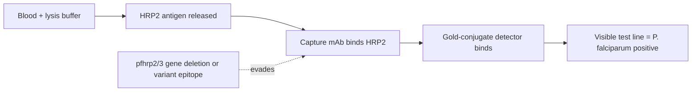

# HRP2-based rapid diagnostic tests

**Therapeutic category:** Diagnostic — malaria antigen detection
**Drug group:** Lateral-flow immunoassay (RDT)
**Drug class:** Histidine-rich protein 2 (HRP2) antigen capture
**Controlled substance:** No

## Overview

HRP2-based rapid diagnostic tests detect histidine-rich protein 2 secreted by [[plasmodium-falciparum]]. Lateral-flow immunoassay, finger-prick blood, ~15 min result. Mainstay of point-of-care falciparum diagnosis in [[endemic-malaria-settings]]. Performance now threatened by parasite strains evading HRP2 detection [c:7381fab5] [c:39b493f0] *(pending review)*.

## Indication (Why is this medication prescribed?)

- Point-of-care diagnosis of [[falciparum-malaria]] in endemic settings [c:7381fab5] *(pending review)*.
- Triage of febrile illness where microscopy unavailable.

## Mechanism of Action (How does it work?)

Capture antibodies on nitrocellulose strip bind HRP2 antigen from lysed parasitized erythrocytes; gold-conjugated detection antibody yields visible test line.

Resistance mechanism: [[plasmodium-falciparum]] strains with *pfhrp2*/*pfhrp3* gene deletions or epitope variation evade antigen capture, producing false negatives [c:7381fab5] (meta-analysis, endemic setting) [c:39b493f0] *(pending review)*.

## Dosage and Administration

_No dose claims in current corpus._ Diagnostic device — single-use per suspected case per manufacturer instructions.

## Contraindications (When not to use it)

_No contraindication claims in current corpus._

## Warnings and Precautions

- False-negative risk in regions with circulating *pfhrp2*/*pfhrp3*-deleted [[plasmodium-falciparum]] [c:7381fab5] [c:39b493f0] *(pending review)*.
- Negative HRP2 RDT in symptomatic patient from endemic area → confirm with microscopy, PCR, or non-HRP2 RDT ([[pldh-rapid-diagnostic-tests]]).
- Does not detect [[plasmodium-vivax]], [[plasmodium-ovale]], or [[plasmodium-malariae]] reliably (HRP2 is *P. falciparum*-specific).

## Side Effects

_No adverse-event claims in current corpus._ Diagnostic — finger-prick only, minimal harm.

## Drug Interactions

_No interaction claims in current corpus._

## Storage and Stability

_No storage claims in current corpus._ Manufacturer-specified; typically 2–30 °C, sealed pouch until use.

---
*Last regenerated: 2026-05-13T18:53:58.376056+00:00. Source claims: 2. Evidence mix: 1 meta_analysis · 1 expert_opinion. Both pending review.*
