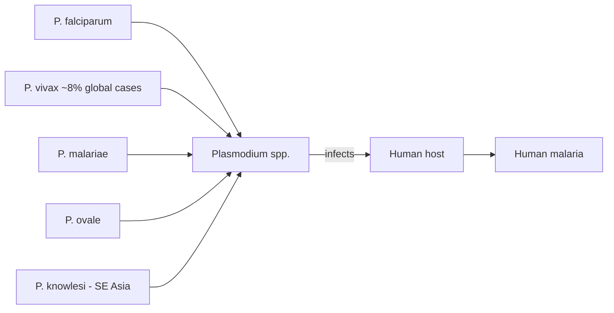

# Human malaria

**Therapeutic category:** _Not applicable — entity is a disease, not a medication._
**Drug group:** _Not applicable._
**Drug class:** _Not applicable._
**Controlled substance:** _Not applicable._

## Overview

Human malaria is a protozoal infection caused by [[plasmodium]] parasites transmitted in endemic settings (pending review) [c:c42ef453]. Six species in the current corpus are implicated: [[plasmodium-falciparum]] [c:e5b88491], [[plasmodium-vivax]] [c:86bb8b28], [[plasmodium-malariae]] [c:91506620], [[plasmodium-ovale]] [c:a80fd411], and the zoonotic [[plasmodium-knowlesi]] in Southeast Asia [c:1663c012] [c:4b60c205]. Entity classified as "medication" by upstream hint, but claim set describes etiology only — no pharmacologic claims present.

## Indication (Why is this medication prescribed?)

_Not applicable — human malaria is the disease, not a therapeutic agent. See condition notes for [[uncomplicated-falciparum-malaria]], [[severe-falciparum-malaria]], [[vivax-malaria]], [[knowlesi-malaria]]._

## Mechanism of Action (How does it work?)

_Not applicable — no pharmacologic mechanism. Etiologic mechanism (parasite → disease) summarized below from current claims._

Species contributions per current corpus (all pending review, expert_opinion grade):
- [[plasmodium-falciparum]] — dominant share of global cases, exact value not stated [c:e5b88491]
- [[plasmodium-vivax]] — ~8% of estimated global malaria cases [c:86bb8b28]
- [[plasmodium-malariae]] [c:91506620], [[plasmodium-ovale]] [c:a80fd411] — endemic contributors, share unspecified
- [[plasmodium-knowlesi]] — zoonotic, leading cause of human malaria in [[malaysia]] vs other Plasmodium spp. (moderate certainty) [c:9a4500e3]; endemic across Southeast Asia [c:1663c012] [c:1ffa0467] [c:4b60c205]

## Dosage and Administration

_No dose claims in current corpus._

## Contraindications (When not to use it)

_Not applicable — disease entity. No contraindication claims in current corpus._

## Warnings and Precautions

_No warning claims in current corpus._ Population qualifiers for elevated geographic risk:
- Southeast Asia / Malaysia → [[plasmodium-knowlesi]] zoonotic transmission must be considered [c:1663c012] [c:4b60c205] [c:9a4500e3]

## Side Effects

_Not applicable — disease entity. No adverse-event claims in current corpus. Clinical features of [[knowlesi-malaria]] referenced in source PMID:28122651 but not extracted as discrete claims._

## Drug Interactions

_Not applicable — no pharmacologic claims._

## Storage and Stability

_Not applicable._

---

**Curator note:** Entity `human malaria` was routed to the `medication` template but is a disease. All 9 claims are etiologic (`<species> causes human malaria`). Recommend reclassifying to `condition` template and re-running. Until then, drug-specific sections held empty per dose-safety rule rather than fabricated.

---
*Last regenerated: 2026-05-13T18:54:35Z. Source claims: 9 (all pending_review). Evidence mix: 9 expert_opinion.*
