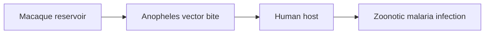

# Human Zoonotic Malaria Infection

**Therapeutic category:** _Not applicable — entity is a disease, not a medication._
**Drug group:** _N/A_
**Drug class:** _N/A_
**Controlled substance:** _N/A_

## Overview

Human zoonotic malaria = malaria infection in humans caused by *Plasmodium* species whose natural reservoir is non-human primates. In Southeast Asia, simian species cross species barrier into humans in endemic settings [c:a04673e7] (pending review) [c:4a688a6e] (pending review). Entity classified as "medication" in source schema but corpus describes disease etiology, not therapeutic agent.

## Indication (Why is this medication prescribed?)

_Not applicable._ Entity is condition, not drug. Cross-reference treatment notes for [[uncomplicated-malaria]] and [[severe-malaria]] therapeutic agents.

## Mechanism of Action (How does it work?)

_Not applicable to medication framing._ Etiologic mechanism per current claims:

- [[plasmodium-inui]] causes human zoonotic malaria in Southeast Asia, endemic setting; certainty very_low, expert opinion [c:a04673e7] (pending review).
- [[plasmodium-cynomolgi]] causes human zoonotic malaria in Southeast Asia, endemic setting; certainty low, expert opinion [c:4a688a6e] (pending review).

Diagram inferred from disease ecology context of cited source; load-bearing etiologic links cited [c:a04673e7] [c:4a688a6e].

## Dosage and Administration

_No dose claims in current corpus._

## Contraindications (When not to use it)

_No contraindication claims in current corpus._

## Warnings and Precautions

_No warning claims in current corpus._ Note: both etiologic claims are `pending_review` with `expert_opinion` grade — treat species attribution as provisional.

## Side Effects

_No side-effect claims in current corpus._ (Entity is disease; clinical features belong in condition note.)

## Drug Interactions

_No interaction claims in current corpus._

## Storage and Stability

_Not applicable._

---
*Last regenerated: 2026-05-13T18:55:34Z. Source claims: 2. Evidence mix: 2 expert_opinion (both pending review). Schema mismatch: entity is a disease, not a medication — recommend reclassification to `condition` type.*
