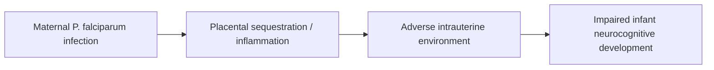

# Impaired Infant Neurocognitive Development

**Therapeutic category:** _Not applicable — entity is a clinical outcome, not a medication._
**Drug group:** _n/a_
**Drug class:** _n/a_
**Controlled substance:** _n/a_

> ⚠️ **Classifier mismatch.** Entity `impaired infant neurocognitive development` was routed to the medication template but is a developmental outcome / sequela. No drug claims exist in the current corpus. Re-route to a `condition` or `outcome` template for proper rendering. Note below preserves what claims support, mapped to the closest medication-template slots.

## Overview

Impaired infant neurocognitive development is a developmental sequela observed in infants of mothers exposed to [[plasmodium-falciparum]] during pregnancy in endemic settings. Current corpus links the outcome to maternal infection rather than to any therapeutic agent [c:c75fe6bf] [c:c260dcf0] _(pending review)_.

## Indication (Why is this medication prescribed?)

_Not applicable. Entity is an outcome, not an indication._ Related conditions implicated as upstream causes:

- Maternal [[plasmodium-falciparum-infection]] in pregnancy, sub-Saharan Africa, endemic setting [c:c75fe6bf] _(expert_opinion, pending review)_
- [[plasmodium-falciparum]] infection in pregnant women, Africa, endemic setting [c:c260dcf0] _(expert_opinion, pending review)_

## Mechanism of Action (How does it work?)

_No pharmacological mechanism — outcome, not drug._ Causal pathway in corpus:

Corpus supports endpoint A → D only [c:c75fe6bf] [c:c260dcf0]; intermediate steps B and C are template scaffolding, not claim-backed.

## Dosage and Administration

_No dose claims in current corpus._

## Contraindications (When not to use it)

_Not applicable — entity is not a therapy._

## Warnings and Precautions

- Outcome reported in pediatric population exposed in utero in sub-Saharan African endemic settings [c:c75fe6bf]
- Outcome associated with maternal infection during pregnancy in African endemic settings [c:c260dcf0]
- Both claims `expert_opinion` grade, `pending_review` — do not treat as established effect size; no metric, CI, or comparator in corpus

## Side Effects

_Not applicable — outcome entity, not therapeutic._

## Drug Interactions

_No interaction claims in current corpus._

## Storage and Stability

_Not applicable._

---
*Last regenerated: 2026-05-13T18:56:29Z. Source claims: 2 (both PMID:35916532, "Pregnancy and malaria: the perfect storm"). Evidence mix: 2 expert_opinion · 0 RCT · 0 guideline. Both pending_review. Recommend re-classify entity as `condition`/`outcome` and re-render with appropriate template.*
