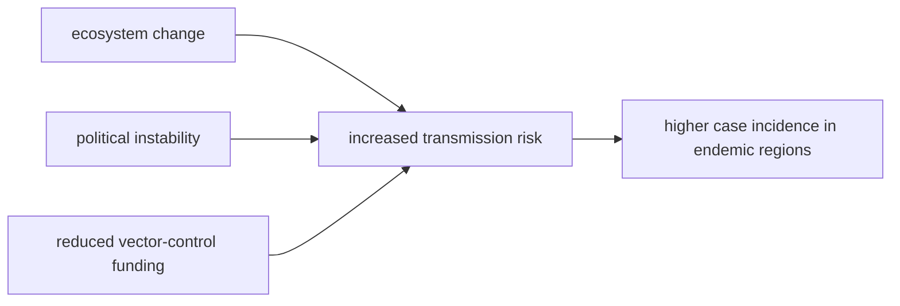

# Increased malaria transmission risk

**Therapeutic category:** Not applicable — entity is an epidemiological outcome, not a medication
**Drug group:** _Not applicable._
**Drug class:** _Not applicable._
**Controlled substance:** _Not applicable._

## Overview

"Increased malaria transmission risk" is not a drug. It is a population-level outcome in [[endemic-malaria]] settings, driven by ecosystem change, political instability, and reduced vector-control funding [c:5a248841] (pending review). Current claim set contains no pharmacological agent — medication template fields below are intentionally empty.

## Indication (Why is this medication prescribed?)

_Not applicable — entity is not a therapeutic agent._

Contextual drivers from corpus:
- Reduced [[vector-control]] funding → ↑ transmission risk in endemic settings [c:2e7096d2] (pending review, low certainty, expert_opinion).
- Ecosystem change + reduced vector-control funding → ↑ transmission risk in endemic settings [c:906e102d] (pending review, moderate certainty).
- Ecosystem change + political instability + reduced vector-control funding → ↑ transmission risk, exceeding temperature alone as comparator [c:5a248841] (pending review, moderate certainty).

## Mechanism of Action (How does it work?)

_Not applicable._ No pharmacological mechanism. Driver cascade from claim corpus:

Multifactorial driver model exceeds temperature-only explanation [c:5a248841].

## Dosage and Administration

_No dose claims in current corpus._ Entity is not a medication.

## Contraindications (When not to use it)

_Not applicable._

## Warnings and Precautions

_Not applicable._ Public-health implication only: funding withdrawal in endemic zones predicted to raise transmission [c:2e7096d2] [c:906e102d].

## Side Effects

_Not applicable._

## Drug Interactions

_Not applicable._ No drug entity.

## Storage and Stability

_Not applicable._

---
*Last regenerated: 2026-05-13T18:57:11+00:00. Source claims: 3. Evidence mix: 3 expert_opinion (all pending review). Note: entity misclassified as medication — recommend reclassification to `epidemiological_outcome` or `risk_factor`.*
