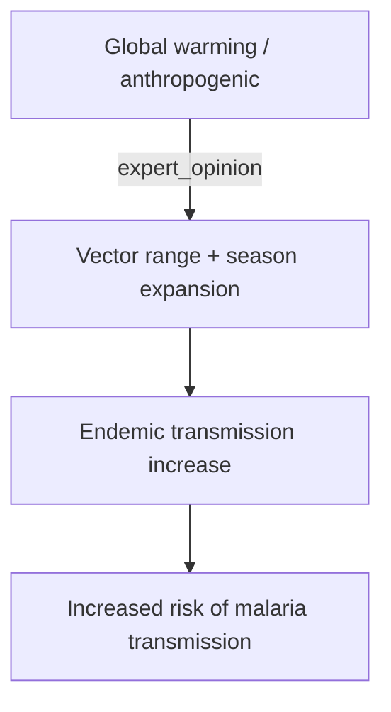

# Increased Risk of Malaria Transmission

**Therapeutic category:** Not applicable — entity is an epidemiological risk outcome, not a pharmacological agent
**Drug group:** Not applicable
**Drug class:** Not applicable
**Controlled substance:** Not applicable

## Overview

"Increased risk of [[malaria-transmission]]" is not a medication. It is an epidemiological outcome linked to [[anthropogenic-global-warming]] in [[malaria-endemic-regions]] [c:7dffbd16] [c:15f0d886]. Current claim corpus contains no pharmacological data for this entity — only causal climate-health claims. Note rendered under medication template per request, but pharmacology sections cannot be populated from present claims (pending review).

## Indication (Why is this medication prescribed?)

_Not applicable — entity is not a therapeutic agent. No indication claims in current corpus._

## Mechanism of Action (How does it work?)

Entity is a risk state, not an agent. Driver claims:

Climate–transmission linkage supported [c:7dffbd16] [c:644076a8] [c:15f0d886] (all evidence_grade=expert_opinion, certainty=moderate, pending review). Vector and parasite biology steps inferred from claim context, not directly asserted.

## Dosage and Administration

_No dose claims in current corpus._

## Contraindications (When not to use it)

_Not applicable. No contraindication claims in current corpus._

## Warnings and Precautions

- Risk elevated in [[endemic-settings]] under warming scenarios [c:7dffbd16] [c:15f0d886] (pending review).
- General-population claim without endemic qualifier also present [c:644076a8] (pending review) — population/setting qualifiers unresolved between claims.

## Side Effects

_Not applicable. No adverse-event claims in current corpus._

## Drug Interactions

_Not applicable. No interaction claims in current corpus._

## Storage and Stability

_Not applicable._

---
*Last regenerated: 2026-05-13T18:57:36Z. Source claims: 3. Evidence mix: 3 expert_opinion (all pending review, single source PMID:27367318). Entity-type mismatch: classified as `medication` but claims describe epidemiological risk — recommend reclassification to `condition` or `risk_factor`.*
