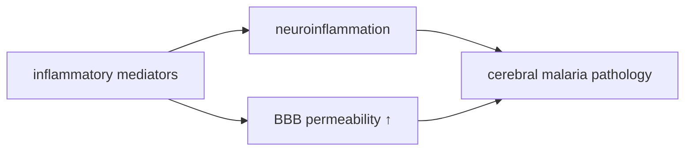

# Inflammatory mediators

**Therapeutic category:** _Not a therapeutic agent — endogenous pathophysiological mediators (cytokines/chemokines). Entity misclassified as medication._
**Drug group:** _N/A_
**Drug class:** _N/A_
**Controlled substance:** _N/A_

## Overview

Inflammatory mediators (cytokines, chemokines) are endogenous signaling molecules, not administered drugs. In current corpus, implicated in [[cerebral-malaria]] pathogenesis: drive [[neuroinflammation]] [c:327c6bed] and increase [[blood-brain-barrier]] permeability [c:8928d809] in inpatient endemic settings. Listed here only because upstream classifier tagged entity as `medication`; reclassification to `pathophysiological-mediator` recommended.

## Indication (Why is this medication prescribed?)

_Not applicable — endogenous mediators, not prescribed._

## Mechanism of Action (How does it work?)

In severe/cerebral malaria (inpatient, endemic), inflammatory mediators drive two load-bearing downstream effects (pending review):

- Cause [[neuroinflammation]] [c:327c6bed] (expert_opinion, moderate certainty, pending review).
- Cause increased [[blood-brain-barrier]] permeability [c:8928d809] (expert_opinion, moderate certainty, pending review).

## Dosage and Administration

_No dose claims in current corpus._ Entity is endogenous; dosing not meaningful.

## Contraindications (When not to use it)

_Not applicable._

## Warnings and Precautions

_No warning claims in current corpus._ Clinical implication: in inpatient endemic [[cerebral-malaria]] cases, mediator-driven BBB disruption and neuroinflammation are pathogenic targets, not therapeutic ones [c:327c6bed][c:8928d809] (pending review).

## Side Effects

_Not applicable — not administered._

## Drug Interactions

_No interaction claims in current corpus._

## Storage and Stability

_Not applicable._

---
*Last regenerated: 2026-05-13T18:58:44Z. Source claims: 2. Evidence mix: 2 expert_opinion (both pending review). Entity-type mismatch flagged — recommend reclassification from `medication` to `pathophysiological-mediator`.*
