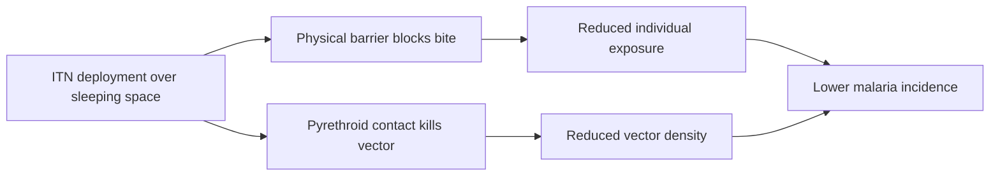

# Insecticide-Treated Bednets

**Therapeutic category:** Vector-control device (malaria prevention)
**Drug group:** Pyrethroid-impregnated physical barrier
**Drug class:** Long-lasting insecticidal net (LLIN)
**Controlled substance:** No

## Overview

Insecticide-treated bednets (ITNs) are mesh sleeping nets impregnated with pyrethroid insecticide. Deployed over sleeping spaces in malaria-endemic settings to block and kill anopheline mosquito vectors during peak nocturnal biting. Core community-level prevention tool against [[plasmodium-falciparum-malaria]].

## Indication (Why is this medication prescribed?)

- Prevention of [[malaria]] in endemic community settings [c:f8d17229] (pending review)
- Prevention of [[plasmodium-falciparum-malaria]] infection in children aged 2–10 years in [[sub-saharan-africa]] [c:98c759c7] (pending review)

## Mechanism of Action (How does it work?)

Physical barrier + contact insecticide. Net mesh blocks mosquito access to sleeper. Pyrethroid coating kills or repels [[anopheles-mosquito]] on contact, reducing vector lifespan and community-level transmission of [[plasmodium-falciparum]] [c:f8d17229] (pending review).

## Dosage and Administration

_No dose claims in current corpus._ Deployment is per-sleeping-space, not weight-based.

## Contraindications (When not to use it)

_No contraindication claims in current corpus._

## Warnings and Precautions

_No warning claims in current corpus._

## Side Effects

_No side-effect claims in current corpus._

## Drug Interactions

_No interaction claims in current corpus._ ITNs typically deployed alongside [[indoor-residual-spraying]], [[seasonal-malaria-chemoprevention]], and case management — synergistic, not pharmacologic.

## Storage and Stability

_No storage claims in current corpus._ Long-lasting formulations retain insecticidal activity across multiple washes per WHO specifications (not in corpus).

---
*Last regenerated: 2026-05-13T18:59:16.090573+00:00. Source claims: 2. Evidence mix: 2 expert_opinion (both pending review).*
