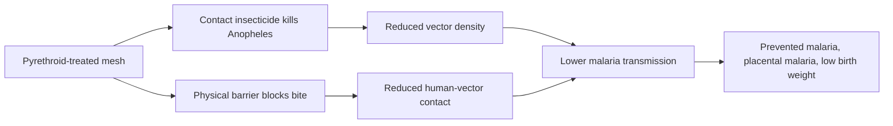

# Insecticide-Treated Nets (ITNs)

**Therapeutic category:** Antimalarial vector control
**Drug group:** Physical barrier + contact insecticide
**Drug class:** Pyrethroid-impregnated bed net
**Controlled substance:** No

## Overview

ITN = bed net treated with pyrethroid insecticide. Physical barrier blocks mosquito contact during sleep; insecticide kills/repels vectors landing on net. Core WHO malaria-prevention tool in endemic settings, including pregnancy. Distributed at community level [c:fca1155d].

## Indication (Why is this medication prescribed?)

- Prevention of [[malaria]] in endemic communities, sub-Saharan Africa [c:fca1155d] (meta-analysis, high certainty)
- Prevention of [[malaria]] at community level in [[ghana]]; ITN ownership rates 28.0–97.8% across surveyed populations [c:74438a86] (pending review)
- Prevention of [[malaria-in-pregnancy]], second/third trimester, sub-Saharan Africa [c:adad8461] (pending review)
- Prevention of [[placental-malaria]] in pregnancy, 2nd/3rd trimester [c:23fbd0bb] (pending review)
- Prevention of [[low-birth-weight]] secondary to malaria in pregnancy [c:7611788b] (pending review)

## Mechanism of Action (How does it work?)

Pyrethroid insecticide ([[pyrethroid]]) bound to net fibers; mosquito contact triggers neurotoxicity via voltage-gated sodium-channel disruption → vector knockdown/death. Physical mesh blocks host-seeking *Anopheles* during peak biting (night). Combined effect reduces human-vector contact and vector population density [c:fca1155d].

[c:fca1155d]

## Dosage and Administration

_No dose claims in current corpus._ Use per WHO/national malaria program guidance: one long-lasting insecticidal net per sleeping space, nightly use, replace per manufacturer/program cycle.

- Adult: nightly use over sleeping area
- Pregnancy (2nd/3rd trimester): nightly use, sub-Saharan Africa [c:adad8461][c:23fbd0bb]
- Pediatric: _no claim_
- Renal/hepatic adjustment: not applicable (topical/environmental exposure)

## Contraindications (When not to use it)

- Absolute: _no claims_
- Relative: _no claims_

Known pyrethroid hypersensitivity = clinical consideration but unsupported by current claim set.

## Warnings and Precautions

- Net integrity (tears, holes) reduces barrier effect — inspect regularly
- Ownership ≠ usage; uptake gap reported in [[ghana]] (range 28.0–97.8%) [c:74438a86]
- Pyrethroid resistance in *Anopheles* populations may erode insecticidal benefit (not in current claims — flag for surveillance)

## Side Effects

- Common: mild skin irritation, transient eye/nasal irritation on first unwrapping (not in current claims)
- Serious: _no claims_
- Rare: _no claims_

## Drug Interactions

Not pharmacologic. Synergistic with [[indoor-residual-spraying]] in ITN-using communities [c:fca1155d]. Complementary to [[intermittent-preventive-treatment-in-pregnancy]] for [[malaria-in-pregnancy]] [c:adad8461].

## Storage and Stability

Store sealed until deployment; avoid prolonged sunlight and washing beyond manufacturer limits (degrades pyrethroid). Long-lasting insecticidal nets retain efficacy ~3 years per WHO program assumptions. _No claim-level stability data in corpus._

---
*Last regenerated: 2026-05-13T18:59:32Z. Source claims: 5. Evidence mix: 1 meta_analysis · 4 expert_opinion.*
