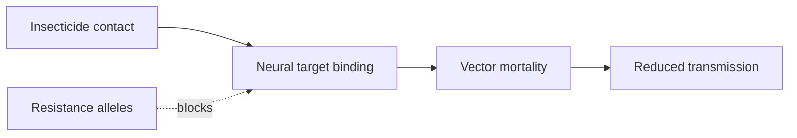

# Insecticides

**Therapeutic category:** Vector control agent (public health)
**Drug group:** Insecticides (class-level entry — pyrethroids, organochlorines, carbamates, organophosphates)
**Drug class:** Heterogeneous — neurotoxic agents targeting arthropod nervous system
**Controlled substance:** No (regulated as pesticides, not pharmaceuticals)

## Overview

Insecticides target [[anopheles-mosquito]] vectors of [[malaria]], deployed via indoor residual spraying (IRS) and insecticide-treated nets (ITNs). Not a patient-administered medication — class entry retained for vector-control linkage. Resistance in *Anopheles* populations now widespread in endemic settings, threatening control programs (pending review) [c:13a80bce][c:5270b8a2].

## Indication (Why is this medication prescribed?)

- Vector control against [[anopheles-mosquito]] in [[malaria]]-endemic settings (pending review) [c:13a80bce][c:5270b8a2]
- Larviciding against [[anopheles-mosquito]] aquatic stages in [[africa]] (pending review) [c:02d86a46]

## Mechanism of Action (How does it work?)

Class-dependent neurotoxicity on arthropod targets — pyrethroids/DDT on voltage-gated sodium channels, carbamates/organophosphates on acetylcholinesterase. Resistance arises via target-site mutations and metabolic detoxification in [[anopheles-mosquito]] populations (pending review, expert_opinion) [c:13a80bce].

Resistance cascade load-bearing [c:13a80bce][c:02d86a46][c:5270b8a2].

## Dosage and Administration

_No dose claims in current corpus._ Deployment (IRS concentration, ITN impregnation, larvicide application rate) governed by WHO PQ vector-control specs, not present in claim set.

## Contraindications (When not to use it)

_No contraindication claims in current corpus._

## Warnings and Precautions

- **Resistance surveillance required:** *Anopheles* vectors resist insecticides in endemic settings — monitor susceptibility before deployment (pending review, expert_opinion) [c:13a80bce][c:5270b8a2]
- **Regional resistance hotspot:** [[africa]] *Anopheles* populations show resistance affecting larviciding programs (pending review, expert_opinion) [c:02d86a46]
- Community-level deployment risks selection pressure amplifying resistance [c:13a80bce]

## Side Effects

_No human side-effect claims in current corpus._ (Class entry — toxicity profile varies by compound.)

## Drug Interactions

_No drug-interaction claims in current corpus._ Cross-resistance between chemical classes is an entomological concern, not pharmacological.

## Storage and Stability

_No storage claims in current corpus._

---
*Last regenerated: 2026-05-13T18:59:56.665821+00:00. Source claims: 3. Evidence mix: 3 expert_opinion (all pending review).*
