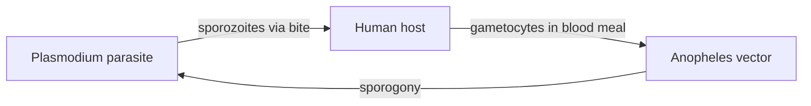

# Host–Vector–Parasite Interaction (Malaria Transmission)

**Therapeutic category:** _Not a medication — transmission-biology concept miscategorised as drug._
**Drug group:** N/A
**Drug class:** N/A
**Controlled substance:** N/A

## Overview

Not a pharmacological agent. Refers to tripartite biological interaction among [[human-host]], [[anopheles-vector]], [[plasmodium-parasite]] required for [[malaria]] transmission in endemic settings [c:3e9f52d3] [c:0494067c] (pending review).

## Indication (Why is this medication prescribed?)

_Not applicable — entity is not a therapeutic agent._

## Mechanism of Action (How does it work?)

Transmission cycle, not drug mechanism. Efficient malaria transmission requires concurrent interaction of human host, Anopheles vector, Plasmodium parasite [c:3e9f52d3] (expert_opinion, pending review). General malaria transmission carries same tripartite requirement [c:0494067c] (expert_opinion, pending review).

[c:3e9f52d3]

## Dosage and Administration

_No dose claims in current corpus._

## Contraindications (When not to use it)

_Not applicable._

## Warnings and Precautions

- Entity miscategorised as `medication`. Reclassify as `concept` or `biological-process` before downstream Master-sheet export.

## Side Effects

_Not applicable._

## Drug Interactions

_Not applicable._

## Storage and Stability

_Not applicable._

---
*Last regenerated: 2026-05-13T19:00:16Z. Source claims: 2. Evidence mix: 2 expert_opinion (both pending review). Entity-type mismatch flagged — not a drug.*
