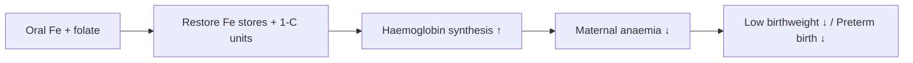

# Iron-Folic Acid Supplementation

**Therapeutic category:** Hematinic / antenatal micronutrient supplement
**Drug group:** Oral iron + folate combination
**Drug class:** Elemental iron salt + pteroylmonoglutamic acid
**Controlled substance:** No

## Overview

Fixed-dose oral combination of elemental iron and folic acid used routinely in antenatal care. Daily supplementation in the second and third trimesters reduces [[maternal-anaemia]], [[low-birthweight]], and [[preterm-birth]] [c:39bdfd76][c:77b59495][c:6c0c06b1]. Standard component of WHO antenatal micronutrient regimens.

## Indication (Why is this medication prescribed?)

- Prevention of [[maternal-anaemia]] in pregnancy (second/third trimester, outpatient) [c:39bdfd76] _(pending review)_
- Prevention of [[low-birthweight]] in newborns of supplemented mothers [c:77b59495]
- Prevention of [[preterm-birth]] in supplemented pregnancies [c:6c0c06b1] _(pending review)_

## Mechanism of Action (How does it work?)

Elemental iron replenishes erythropoietic iron stores → supports haemoglobin synthesis → corrects/prevents iron-deficiency anaemia. [[folic-acid]] supplies one-carbon units for purine/thymidylate synthesis → supports erythropoiesis and fetal tissue growth. Combined effect on maternal haematology plausibly mediates downstream reductions in low birthweight and preterm birth [c:77b59495][c:6c0c06b1].

## Dosage and Administration

| Population | Dose | Route | Frequency | Duration |
|---|---|---|---|---|
| Pregnant adults, 2nd/3rd trimester, outpatient | Elemental iron **30–60 mg** + folic acid (co-formulated) [c:39bdfd76] | Oral | Daily [c:39bdfd76][c:77b59495][c:6c0c06b1] | _Duration not specified in current corpus_ |

Pediatric, renal-adjusted, and non-pregnant adult dosing: _No dose claims in current corpus._

## Contraindications (When not to use it)

_No contraindication claims in current corpus._

## Warnings and Precautions

_No warning/precaution claims in current corpus._ Note: source PMID:36321557 concerns folate–antifolate antimalarial interaction context; no specific warning claim extracted.

## Side Effects

_No adverse-effect claims in current corpus._

## Drug Interactions

_No interaction claims in current corpus._ Source title flags potential interaction with [[antifolate-antimalarials]]; not extracted as a discrete claim.

## Storage and Stability

_No storage claims in current corpus._

---
*Last regenerated: 2026-05-13T19:02:29.650305+00:00. Source claims: 3. Evidence mix: 3 meta_analysis.*
