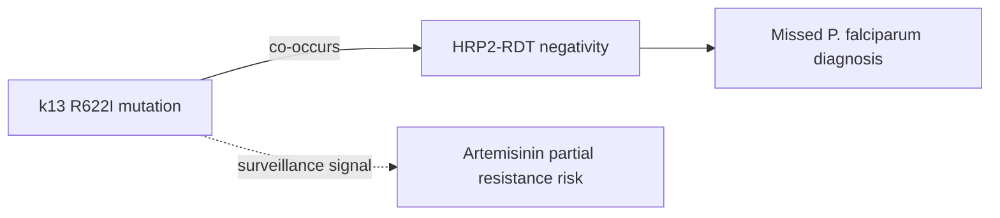

# k13 R622I mutation

**Therapeutic category:** _Not a medication — Plasmodium falciparum kelch13 resistance marker._
**Drug group:** _N/A_
**Drug class:** _N/A_
**Controlled substance:** _N/A_

## Overview

k13 R622I = point mutation in Plasmodium falciparum kelch13 gene. Validated/candidate marker for artemisinin partial resistance. Current claims surface co-occurrence with [[hrp2-rdt-negativity]] in northern Ethiopia — diagnostic-escape concern alongside resistance signal [c:7688fd14] [c:94c8720f]. Entity classified as medication in pipeline but is a genetic variant, not a therapeutic agent — sections below reflect that.

## Indication (Why is this medication prescribed?)

_Not applicable — genetic resistance marker, not prescribed._ Surveillance target for [[artemisinin-resistance]] monitoring and [[hrp2-deletion]] / RDT-failure investigation.

## Mechanism of Action (How does it work?)

_No mechanistic claims in current corpus._ Marker only; co-occurrence with HRP2-RDT negativity reported, causal pathway not specified in claims [c:7688fd14] [c:94c8720f].

Diagram = claim-supported co-occurrence + contextual surveillance link. Causality not asserted [c:7688fd14] [c:94c8720f].

## Dosage and Administration

_No dose claims in current corpus._ Not a drug.

## Contraindications (When not to use it)

_Not applicable._

## Warnings and Precautions

- **Diagnostic escape risk (pending review):** R622I mutants in [[northwestern-ethiopia]] showed 48.3% HRP2-RDT negativity vs 30.7% in wild-type parasites — surveillance concern for false-negative RDTs [c:94c8720f] (expert_opinion, moderate certainty).
- **Geographic hotspot (pending review):** Co-occurrence prevalence 28.9% in [[gondar-zuria]] vs 12.9% in [[tach-armachiho]], Ethiopia — suggests focal emergence [c:7688fd14].
- Confirm suspected [[plasmodium-falciparum]] cases with microscopy or PCR where R622I circulation suspected and RDT is negative.

## Side Effects

_Not applicable — genetic marker, no pharmacologic effects._

## Drug Interactions

_No interaction claims in current corpus._ R622I is monitored as predictor of reduced [[artemisinin]] / [[artemether-lumefantrine]] efficacy in some African settings — no such claim in present corpus.

## Storage and Stability

_Not applicable._

---
*Last regenerated: 2026-05-13T19:03:23Z. Source claims: 2. Evidence mix: 2 expert_opinion (both pending review). Note: entity is a resistance mutation, not a medication — medication template fields largely N/A.*
