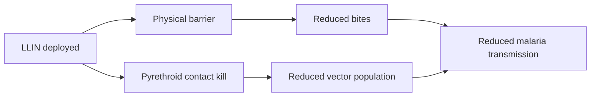

# Long-Lasting Insecticidal Nets

**Therapeutic category:** Vector control device
**Drug group:** Insecticide-treated bed net
**Drug class:** Pyrethroid-impregnated physical barrier
**Controlled substance:** No

## Overview

Long-lasting insecticidal nets (LLINs) are bed nets factory-treated with pyrethroid insecticide bonded to fibers, retaining bioactivity across multiple washes. Deployed at community level in malaria-endemic regions, LLINs combine physical barrier and contact insecticide action against [[anopheles-mosquito]] vectors. Core tool in [[malaria]] prevention programs.

## Indication (Why is this medication prescribed?)

- Prevention of [[malaria]] transmission in endemic communities across [[africa]] [c:79d49ea3] (pending review)
- Population-level [[malaria]] vector control in endemic settings such as [[jimma-zone-ethiopia]] [c:a5f00c46] (pending review)

## Mechanism of Action (How does it work?)

Physical barrier blocks mosquito-host contact during sleep. Pyrethroid coating delivers contact toxicity to *Anopheles* vectors landing on net surface, reducing vector survival and transmission intensity at community scale when coverage is high [c:a5f00c46] (pending review).

Cascade load-bearing on [c:a5f00c46].

## Dosage and Administration

_No dose claims in current corpus._ Coverage threshold (not a dose): **≥90% LLIN coverage** reported as threshold for effective community-level [[malaria]] control in [[jimma-zone-ethiopia]] [c:a5f00c46] (pending review, expert_opinion).

## Contraindications (When not to use it)

_No contraindication claims in current corpus._

## Warnings and Precautions

_No warning or precaution claims in current corpus._ Note: pyrethroid resistance in vectors may erode effectiveness — not surfaced by current claims.

## Side Effects

_No side-effect claims in current corpus._

## Drug Interactions

_No interaction claims in current corpus._

## Storage and Stability

_No storage claims in current corpus._

---
*Last regenerated: 2026-05-13T19:03:45.491111+00:00. Source claims: 2. Evidence mix: 2 expert_opinion (both pending review).*
