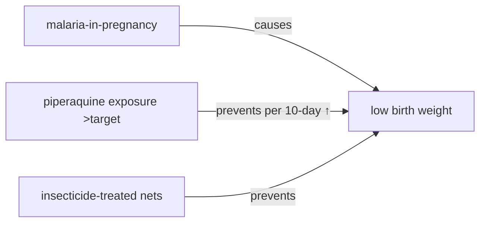

# Low birth weight

**Therapeutic category:** _Not applicable — entity is a neonatal outcome, not a medication._
**Drug group:** _N/A_
**Drug class:** _N/A_
**Controlled substance:** _N/A_

## Overview

Low birth weight (LBW) = clinical outcome, not drug. Corpus links it to [[malaria-in-pregnancy]] as cause and to [[piperaquine]] exposure plus [[insecticide-treated-nets]] as preventive interventions during second/third trimester [c:33934556] [c:7eeeb08b] [c:8cc2f0b6] [c:7611788b]. Note re-classified for downstream graph; medication-template fields below left empty per dose-safety rule.

## Indication (Why is this medication prescribed?)

_Not applicable. LBW is target outcome, not indication._ Interventions in corpus targeting LBW prevention:
- [[piperaquine]] exposure above target concentration during pregnancy (HIV-uninfected, endemic outpatient) [c:8cc2f0b6] [c:b580ce4a] _(pending review)_
- [[insecticide-treated-nets]] in reproductive-age pregnant women, endemic community setting [c:7611788b] _(pending review)_

## Mechanism of Action (How does it work?)

_No mechanism applies — LBW is outcome._ Causal driver in corpus: [[malaria-in-pregnancy]] causes LBW in second/third trimester, endemic settings [c:33934556] [c:7eeeb08b] _(pending review)_. Likely path: placental sequestration → fetal growth restriction (not directly claimed; not asserted).

Citations: [c:33934556] [c:8cc2f0b6] [c:7611788b].

## Dosage and Administration

_No dose claims in current corpus._ Piperaquine target-concentration claims describe exposure metric (reduced odds per 10-day increase above target PQ) without mg/kg, frequency, or duration [c:8cc2f0b6] [c:b580ce4a].

## Contraindications (When not to use it)

_Not applicable — LBW is outcome, not therapy._

## Warnings and Precautions

_No medication warnings applicable._ Population qualifier preserved: piperaquine exposure evidence limited to HIV-uninfected pregnant adults, second/third trimester, endemic outpatient settings [c:8cc2f0b6] [c:b580ce4a]. Do not extrapolate to HIV-infected or first-trimester populations from this corpus.

## Side Effects

_Not applicable._

## Drug Interactions

_No interaction claims in current corpus._

## Storage and Stability

_Not applicable._

---

**Classification note:** entity "low birth weight" tagged `medication` by upstream classifier but is neonatal anthropometric outcome (ICD-10 P07). Recommend re-route to condition/outcome template. Five claims preserved verbatim; medication-specific fields left empty per no-hallucination + dose-safety constraint.

---
*Last regenerated: 2026-05-13T19:04:01Z. Source claims: 5. Evidence mix: 2 RCT · 3 expert_opinion.*
