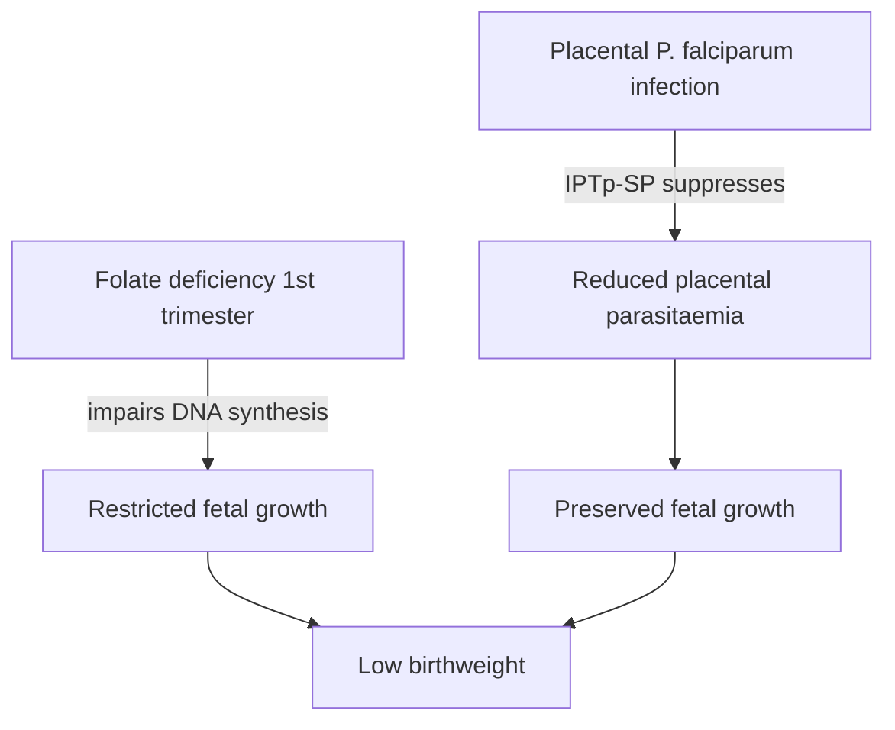

# Low birthweight

**Therapeutic category:** Not applicable — outcome, not medication
**Drug group:** Not applicable
**Drug class:** Not applicable
**Controlled substance:** No

## Overview

Low birthweight (<2500 g at delivery) = neonatal outcome, not drug. Entity mis-classified as medication. Current claim set links it to malaria-in-pregnancy interventions and folate status. Note retained as outcome reference; cross-link from causative/preventive medications.

## Indication (Why is this medication prescribed?)

_Not applicable — low birthweight is an endpoint, not a therapeutic agent._ Related interventions targeting this outcome:

- [[sulfadoxine-pyrimethamine]] IPTp prevents low birthweight in [[pregnancy-second-third-trimester]], sub-Saharan Africa, where quintuple-mutation prevalence <90% [c:029ce5c3] (expert_opinion, pending review)
- [[iron-folic-acid-supplementation]] daily prevents low birthweight in second/third trimester [c:77b59495] (meta_analysis, high certainty)

## Mechanism of Action (How does it work?)

_Not applicable — outcome._ Mechanistic links from claims:

[[folate-deficiency]] in first trimester causes low birthweight [c:6f7139ab] (meta_analysis, pending review).

## Dosage and Administration

_No dose claims in current corpus._ Outcome has no dose. Preventive regimens belong on respective drug notes ([[sulfadoxine-pyrimethamine]], [[iron-folic-acid-supplementation]], [[dihydroartemisinin-piperaquine]]).

## Contraindications (When not to use it)

_Not applicable — outcome, not agent._

## Warnings and Precautions

Iatrogenic risk signal:

- Monthly [[dihydroartemisinin-piperaquine]] + [[sulfadoxine-pyrimethamine]] combined IPTp regimen ↑ low birthweight risk vs SP-alone in Uganda, RR 1.48 (95% CI 1.04–2.12) [c:50fb674b] (RCT, moderate certainty). Avoid combo IPTp pending further evidence.

## Side Effects

_Not applicable — outcome._

## Drug Interactions

Intervention-outcome relations (not pharmacokinetic):

- ↑ risk: [[dihydroartemisinin-piperaquine]] + [[sulfadoxine-pyrimethamine]] monthly combo vs SP alone, RR 1.48 [c:50fb674b]
- ↓ risk: [[sulfadoxine-pyrimethamine]] IPTp where qmut <90% [c:029ce5c3]
- ↓ risk: daily [[iron-folic-acid-supplementation]] [c:77b59495]
- ↑ risk: [[folate-deficiency]] first trimester [c:6f7139ab]

## Storage and Stability

_Not applicable — outcome._

---
*Last regenerated: 2026-05-13T19:04:24Z. Source claims: 4. Evidence mix: 2 meta_analysis · 1 RCT · 1 expert_opinion.*
