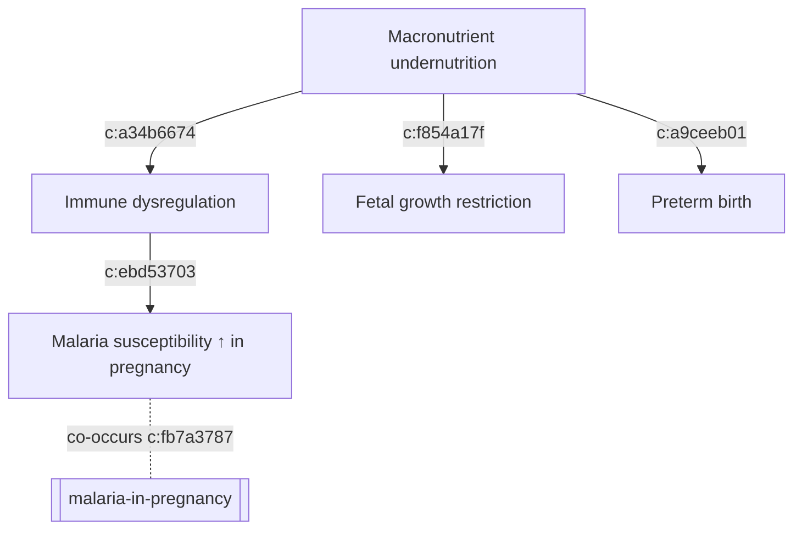

# Macronutrient Undernutrition

**Therapeutic category:** Not applicable — nutritional deficiency state, not a medication
**Drug group:** N/A
**Drug class:** N/A
**Controlled substance:** No

## Overview

Macronutrient undernutrition = deficient intake of protein, carbohydrate, fat. Not a drug. Classifier mislabeled this entity as medication. Note re-framed as condition profile pending entity-type correction. In pregnancy, undernutrition drives immune dysregulation, raises malaria susceptibility, harms fetus [c:ebd53703] [c:a34b6674] [c:f854a17f].

## Indication (Why is this medication prescribed?)

_Not a medication. No prescribing indication._ Relevant clinical contexts where undernutrition is identified and treated nutritionally:
- [[malaria-in-pregnancy]] co-occurrence in endemic settings (pending review) [c:fb7a3787]
- Antenatal care in second/third trimester (pending review) [c:f854a17f] [c:a9ceeb01]

## Mechanism of Action (How does it work?)

Pathophysiology, not pharmacology. Undernutrition → immune dysregulation [c:a34b6674] → increased malaria susceptibility in pregnancy [c:ebd53703]. Independent of malaria, undernutrition restricts fetal growth and triggers preterm birth [c:f854a17f] [c:a9ceeb01].

All mechanistic links graded `expert_opinion`, status `pending_review`.

## Dosage and Administration

_No dose claims in current corpus._ Nutritional repletion protocols (energy/protein supplementation, balanced energy-protein supplements) not present in claim set.

## Contraindications (When not to use it)

_Not applicable — undernutrition is a state, not a therapy._ No contraindication claims in current corpus.

## Warnings and Precautions

Pregnancy-specific risks when undernutrition present in second/third trimester (pending review):
- Heightened malaria susceptibility in [[malaria-endemic-settings]] [c:ebd53703]
- Immune dysregulation [c:a34b6674]
- [[fetal-growth-restriction]] [c:f854a17f]
- [[preterm-birth]] [c:a9ceeb01]
- Co-occurrence with [[malaria-in-pregnancy]] in endemic regions [c:fb7a3787]

Monitoring: antenatal weight, MUAC, fundal height, malaria screening in endemic areas. _Specific thresholds not in claim set._

## Side Effects

_Not applicable — no pharmacologic adverse effect profile._ Sequelae of the state itself listed under Warnings.

## Drug Interactions

_No interaction claims in current corpus._ Nutritional status may modulate antimalarial pharmacokinetics, but no claim supports this here.

## Storage and Stability

_Not applicable._

---
*Last regenerated: 2026-05-13T19:04:46Z. Source claims: 5. Evidence mix: 5 expert_opinion (all pending review). Entity-type flag: classified as `medication` but content is a nutritional deficiency state — recommend re-classification to `condition`.*
