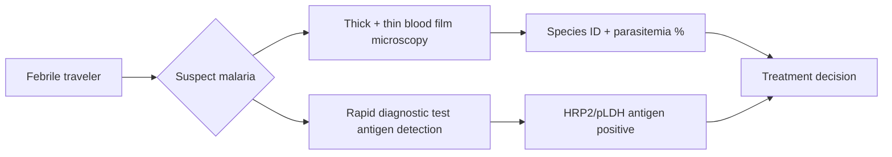

# Malaria diagnosis

**Therapeutic category:** Diagnostic workflow (not a pharmacologic agent)
**Drug group:** _Not applicable — entity is diagnostic, not medication._
**Drug class:** _Not applicable._
**Controlled substance:** No

## Overview

Entity classified as "medication" but corpus claims describe diagnostic modalities for [[malaria]], not a drug. Current claims compare [[rapid-diagnostic-tests]] vs [[thick-and-thin-blood-film-microscopy]] for confirming malaria in [[febrile-illness-returning-traveler]] and military personnel. No pharmacologic content available.

## Indication (Why is this medication prescribed?)

- Confirm malaria in febrile [[returning-traveler]] presenting with undifferentiated febrile illness [c:92bd9044] (pending review, expert_opinion).
- Triage of suspected malaria in military personnel via [[rapid-diagnostic-tests]] vs blood film microscopy [c:d324ea3a] (pending review, expert_opinion).
- Inpatient confirmation of malaria in UK travelers via thick + thin film microscopy [c:5f151210] (pending review, expert_opinion, high certainty).

## Mechanism of Action (How does it work?)

Not pharmacologic. Diagnostic mechanism only:

UK inpatient pathway favors thick + thin film microscopy as reference modality [c:5f151210]. Field/military pathway favors RDT vs microscopy [c:d324ea3a].

## Dosage and Administration

_No dose claims in current corpus._ Entity is diagnostic, not a dosed agent.

## Contraindications (When not to use it)

_No contraindication claims in current corpus._

## Warnings and Precautions

- Disagreement on preferred modality: RDT recommended in military setting [c:d324ea3a] vs microscopy recommended in UK inpatient traveler setting [c:5f151210]. Population/setting qualifiers load-bearing — do not generalize across contexts.
- All three claims `pending_review`, evidence_grade `expert_opinion` only. No RCT, meta-analysis, or guideline-grade support yet.

## Side Effects

_Not applicable — diagnostic, not pharmacologic._

## Drug Interactions

_Not applicable — diagnostic, not pharmacologic._

## Storage and Stability

_No claims in current corpus._ (RDT kit storage typically vendor-specific; not asserted here.)

---
*Last regenerated: 2026-05-13T19:06:42Z. Source claims: 3. Evidence mix: 3 expert_opinion (all pending review). Note: entity mis-classified as medication — content is diagnostic workflow.*
