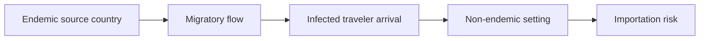

# Malaria importation risk

**Therapeutic category:** _Not a medication — epidemiological phenomenon mis-classified as drug entity._
**Drug group:** _N/A_
**Drug class:** _N/A_
**Controlled substance:** _N/A_

## Overview

Malaria importation risk = probability that [[plasmodium]] parasites enter [[non-endemic-areas]] via infected travelers or migrants. Migratory flows from endemic countries drive this risk [c:e5269e68] (pending review) [c:32a9b12e] (pending review). Entity not a drug; no pharmacological content applies.

## Indication (Why is this medication prescribed?)

_Not applicable — entity is a risk concept, not a therapeutic agent._

## Mechanism of Action (How does it work?)

Risk pathway, not pharmacological MoA:

Migratory flows from endemic countries causally linked to importation risk in non-endemic settings [c:32a9b12e] (pending review, moderate certainty, expert_opinion). Underlying climate/environment context noted in source [c:e5269e68] (pending review, low certainty).

## Dosage and Administration

_No dose claims in current corpus._

## Contraindications (When not to use it)

_No contraindication claims in current corpus._

## Warnings and Precautions

_No warning claims in current corpus._ Surveillance implication only: non-endemic settings receiving migratory flows from endemic countries warrant heightened case detection [c:32a9b12e] (pending review).

## Side Effects

_Not applicable._

## Drug Interactions

_Not applicable._

## Storage and Stability

_Not applicable._

---
*Last regenerated: 2026-05-13T19:07:21Z. Source claims: 2. Evidence mix: 2 expert_opinion (both pending review). Entity mis-typed as `medication`; reclassify as epidemiological-concept recommended.*
