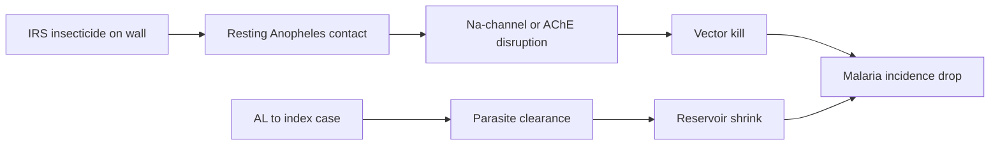

# Indoor Residual Spraying Insecticides (± Artemether-Lumefantrine)

**Therapeutic category:** Antimalarial vector-control agents (+ ACT co-intervention)
**Drug group:** Pyrethroid and non-pyrethroid residual insecticides; artemisinin combination therapy
**Drug class:** Organochlorines (DDT), pyrethroids (deltamethrin), carbamates (bendiocarb, propoxur), organophosphates (pirimiphos-methyl); artemisinin + aryl-amino-alcohol partner
**Controlled substance:** No

> **Scope note:** Source entity `malaria incidence` is an outcome, not a drug. Claim set centres on IRS insecticides ± [[artemether-lumefantrine]] used against [[plasmodium-falciparum]]. Note synthesises the intervention side.

## Overview

Indoor residual spraying (IRS) coats interior walls with long-acting insecticide to kill resting [[anopheles-mosquito]] vectors. Deployed alongside [[insecticide-treated-nets]] (ITNs) in endemic [[sub-saharan-africa]] and elimination settings (Namibia). Reactive focal IRS plus [[artemether-lumefantrine]] tested for spillover prevention around index cases.

## Indication (Why is this medication prescribed?)

- Prevention of [[uncomplicated-falciparum-malaria]] in pediatric populations in endemic [[sub-saharan-africa]], added to ITNs [c:bc57bd82] [c:037f304e] [c:befd58d4] [c:f6af45c4] (pending review).
- Reactive focal intervention around index cases for [[malaria-elimination]] in low-transmission [[namibia]] [c:0670e3b6] (pending review).

## Mechanism of Action (How does it work?)

Pyrethroids (DDT, deltamethrin) hyperactivate insect voltage-gated sodium channels → vector paralysis [c:bc57bd82]. Non-pyrethroids: carbamates and organophosphates (bendiocarb, pirimiphos-methyl, propoxur) inhibit acetylcholinesterase → cholinergic crisis in resting mosquitoes [c:037f304e] [c:f6af45c4]. Vector mortality on treated walls breaks transmission. Co-administered [[artemether-lumefantrine]] clears parasitaemia in humans → reduces infectious reservoir → spillover protection ≤1 km from index case [c:0670e3b6].

## Dosage and Administration

_No mg/kg or frequency claims in current corpus._ Claim-supported regimens:

| Indication | Agent | Route | Population | Source |
|---|---|---|---|---|
| Adjunct to ITNs | DDT or deltamethrin, IRS | Wall application | Pediatric, endemic SSA | [c:bc57bd82] [c:befd58d4] |
| Adjunct to ITNs | Bendiocarb, pirimiphos-methyl, or propoxur, IRS | Wall application | Pediatric, endemic SSA | [c:037f304e] [c:f6af45c4] |
| Reactive focal, elimination | Pirimiphos-methyl IRS + [[artemether-lumefantrine]] PO | Wall + oral | Namibia, all ages | [c:0670e3b6] |

Doses, spray cycles, AL mg/kg schedule **not specified in claim set** — consult [[who-malaria-guidelines]].

## Contraindications (When not to use it)

_No contraindication claims in current corpus._

## Warnings and Precautions

- **Efficacy uncertain when added to ITNs (pyrethroid IRS):** rate ratio 1.07 (95% CI 0.80–1.43) vs ITNs alone — no net benefit demonstrated, possible cross-resistance with ITN pyrethroid [c:bc57bd82] [c:befd58d4] (moderate certainty, pending review).
- **Non-pyrethroid IRS + ITNs:** rate ratio 0.93 (CI 0.46–1.86) [c:037f304e] and 0.86 (CI 0.61–1.23) [c:f6af45c4] — wide CIs, very-low to low certainty. Routine addition not supported.
- **Spillover benefit zone limited to ~1 km** around index case for reactive AL+IRS [c:0670e3b6].

## Side Effects

_No adverse-event claims in current corpus._ Population-level harms (insecticide resistance selection, occupational exposure) not in claim set.

## Drug Interactions

- **Pyrethroid IRS × pyrethroid ITN:** suspected ↓ marginal efficacy via shared resistance mechanism — null effect signal [c:bc57bd82] [c:befd58d4].
- **[[artemether-lumefantrine]] × pirimiphos-methyl IRS:** additive transmission reduction; 43% (CI 20–59%) drop in incidence among non-recipients ≤1 km from index case [c:0670e3b6].

## Storage and Stability

_No storage claims in current corpus._

---
*Last regenerated: 2026-05-13T19:07:38Z. Source claims: 5. Evidence mix: 4 meta_analysis · 1 RCT. All claims status = pending_review.*
