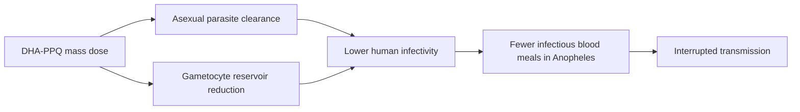

# Dihydroartemisinin–piperaquine (focal mass treatment for malaria transmission)

**Therapeutic category:** Antimalarial
**Drug group:** Artemisinin-based combination therapy (ACT)
**Drug class:** Sesquiterpene endoperoxide (dihydroartemisinin) + bisquinoline (piperaquine)
**Controlled substance:** No

## Overview

Dihydroartemisinin–piperaquine (DHA-PPQ) is deployed beyond curative use as a **focal mass treatment** agent to interrupt [[malaria-transmission]] in elimination programmes, notably across the [[greater-mekong-subregion]] (pending review) [c:aecdb983]. Transmission itself requires the triad of human host, [[anopheles-mosquito]] vector, and [[plasmodium]] parasite, so chemotherapeutic mass treatment is one arm of a multi-modal strategy that also includes vector control [c:0494067c].

## Indication (Why is this medication prescribed?)

- Focal mass drug administration to suppress residual [[plasmodium-falciparum]] reservoirs in elimination settings, Greater Mekong subregion (pending review) [c:aecdb983].
- Community-level transmission reduction in endemic settings (pending review) [c:20465445].

_Curative-treatment indications for uncomplicated falciparum malaria are out of scope for this transmission-focused note — no curative-dose claims in current corpus._

## Mechanism of Action (How does it work?)

DHA clears asexual blood-stage parasites and reduces gametocyte carriage; piperaquine provides a long post-treatment prophylactic tail that suppresses re-emergence. By depleting the human infectious reservoir across a focal population simultaneously, mass treatment lowers the probability that an [[anopheles-mosquito]] blood-meal yields onward infection [c:aecdb983][c:20465445]. Transmission depends on the host–vector–parasite interaction, so reservoir depletion targets the host arm of that triad [c:0494067c].

Mechanistic cascade load-bearing claim [c:aecdb983].

## Dosage and Administration

_No dose claims in current corpus._ Both supporting claims [c:aecdb983][c:20465445] name DHA-PPQ as the agent for focal mass treatment but do not specify mg/kg, frequency, or duration. Programmatic dosing must be sourced from WHO/national guideline documents, not inferred here.

## Contraindications (When not to use it)

_No contraindication claims in current corpus._

## Warnings and Precautions

_No warning or precaution claims in current corpus for the transmission-blocking indication._ Piperaquine QT-prolongation and DHA pregnancy considerations are documented elsewhere but absent from these claims.

## Side Effects

_No adverse-effect claims in current corpus._

## Drug Interactions

_No interaction claims in current corpus._

## Storage and Stability

_No storage or stability claims in current corpus._

## Programmatic context (complementary interventions)

DHA-PPQ mass treatment is one lever; the cited corpus also references parallel transmission-control modalities that should be co-deployed:

- [[long-lasting-insecticidal-nets]] — community coverage ≥ 90% modelled as threshold for effective control, Jimma Zone, Ethiopia (pending review, expert opinion) [c:a5f00c46].
- [[indoor-residual-spraying]] adjunct to LLINs, Jimma Zone, Ethiopia (pending review, expert opinion) [c:781b1a95].
- [[endochin-like-quinolones]] applied via mosquito-targeted delivery vs insecticide-only nets, preclinical (pending review) [c:83aad3b9].
- [[transmission-blocking-vaccines]] in development, community endemic settings (pending review) [c:0b8a7a66].
- [[anopheles-mosquito]] remains the obligate vector across 87 countries with ongoing transmission [c:ac4b29da][c:7fc0d7ef].

---
*Last regenerated: 2026-05-13T19:09:05Z. Source claims: 9. Evidence mix: 1 meta-analysis · 8 expert-opinion. All claims pending review — none promoted.*
