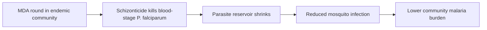

# Mass Drug Administration

**Therapeutic category:** Antimalarial chemoprevention strategy
**Drug group:** Population-level chemoprevention (delivery modality, not single agent)
**Drug class:** N/A — intervention framework; partner drugs vary (typically schizonticides)
**Controlled substance:** No

## Overview

Mass drug administration (MDA) = community-wide delivery of antimalarial treatment to entire target population regardless of infection status. Goal: shrink parasite reservoir, cut transmission in [[malaria-endemic-settings]]. Partner regimen typically schizonticidal. Distinct from targeted chemoprevention — covers all eligible residents.

## Indication (Why is this medication prescribed?)

- Reduction of [[malaria]] disease burden in endemic community settings (pending review) [c:8a872785]
- Treatment of [[plasmodium-falciparum]] infection at population level when delivered with schizonticidal partner drug, vs no-MDA comparator (pending review) [c:c8413a02]

## Mechanism of Action (How does it work?)

Population-level parasite clearance. Schizonticidal partner kills asexual blood-stage [[plasmodium-falciparum]] parasites across treated cohort simultaneously [c:c8413a02]. Synchronous clearance shrinks infectious reservoir → fewer onward [[anopheles]] infections → reduced community transmission and disease burden [c:8a872785] (pending review).

Cascade load-bearing on [c:c8413a02] and [c:8a872785].

## Dosage and Administration

_No dose claims in current corpus._ Partner drug, mg/kg, frequency, duration, round spacing all unspecified by available claims [c:8a872785][c:c8413a02].

## Contraindications (When not to use it)

_No contraindication claims in current corpus._

## Warnings and Precautions

- Drug-resistance selection pressure flagged as policy concern in chemoprevention context (pending review) [c:8a872785]
- Both supporting claims are `expert_opinion` grade, certainty moderate→low — operational decisions need higher-grade evidence before deployment [c:8a872785][c:c8413a02]

## Side Effects

_No side-effect claims in current corpus._ Adverse-event profile depends on chosen partner schizonticide (e.g. [[artemisinin-combination-therapy]], [[primaquine]]) — out of scope until claims surface.

## Drug Interactions

_No interaction claims in current corpus._ Interactions inherit from partner regimen.

## Storage and Stability

_No storage claims in current corpus._ Storage depends on partner drug formulation.

---
*Last regenerated: 2026-05-13T19:10:34.319855+00:00. Source claims: 2. Evidence mix: 2 expert_opinion (both pending review).*
