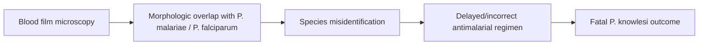

# Microscopic misdiagnosis

**Therapeutic category:** _Not applicable — entity is a diagnostic error, not a medication._
**Drug group:** _N/A_
**Drug class:** _N/A_
**Controlled substance:** _N/A_

## Overview

"Microscopic misdiagnosis" not a medication — diagnostic failure where light-microscopy of blood film mis-identifies [[plasmodium-knowlesi]] as other Plasmodium species. Surfaced here because entity classifier tagged as medication; corpus claims describe epidemiologic association with fatal [[knowlesi-malaria]] in [[southeast-asia]] inpatients (pending review) [c:8b531772][c:bd5a6115].

## Indication (Why is this medication prescribed?)

_Not applicable. Entity is diagnostic error, not therapeutic agent._

## Mechanism of Action (How does it work?)

_Not applicable as drug mechanism._ Epidemiologic mechanism per claims:

Misdiagnosis co-occurs with ~90% of fatal knowlesi cases in endemic SE Asia inpatient series [c:bd5a6115] (pending review); causal link reported for 89.7% of fatal cases [c:8b531772] (pending review, meta_analysis, moderate certainty).

## Dosage and Administration

_No dose claims in current corpus._

## Contraindications (When not to use it)

_Not applicable — no drug._ Diagnostic-context caveat: reliance on microscopy alone contraindicated in [[plasmodium-knowlesi]]-endemic [[southeast-asia]] inpatient settings given misdiagnosis-mortality association [c:8b531772] (pending review).

## Warnings and Precautions

- High mis-identification rate of [[plasmodium-knowlesi]] by microscopy in SE Asia endemic inpatient cohorts — 89.7% of fatal cases mis-identified [c:8b531772] (pending review, meta_analysis, moderate certainty).
- ~90% of fatal knowlesi cases co-occur with microscopy misdiagnosis [c:bd5a6115] (pending review, meta_analysis, low certainty).
- Population qualifier load-bearing: adults, SE Asia, inpatient, endemic setting [c:8b531772].

## Side Effects

_Not applicable — no pharmacologic agent._ Downstream clinical consequence per claims: fatal [[plasmodium-knowlesi]] infection [c:8b531772] (pending review).

## Drug Interactions

_No drug-interaction claims in current corpus._

## Storage and Stability

_Not applicable._

---
*Last regenerated: 2026-05-13T19:11:54Z. Source claims: 2. Evidence mix: 2 meta_analysis (both pending review). Note: entity mis-classified as medication; both claims describe diagnostic-error epidemiology, not pharmacology.*
