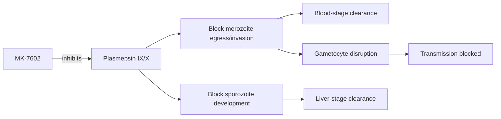

# MK-7602

**Therapeutic category:** Antimalarial (investigational)
**Drug group:** Multi-stage dual-targeting antimalarial
**Drug class:** Plasmepsin IX/X inhibitor [c:f9ebfb67]
**Controlled substance:** No

## Overview

MK-7602 is an investigational antimalarial under development for [[plasmodium-falciparum-malaria]]. Acts across multiple parasite life-cycle stages — liver, blood, and transmission — via dual-targeting mechanism [c:71bcbe6f] [c:abe83a25] (pending review). All current claims are `expert_opinion` grade from a single PubMed source.

## Indication (Why is this medication prescribed?)

- [[uncomplicated-falciparum-malaria]] [c:f9ebfb67] (pending review)
- [[drug-resistant-plasmodium-falciparum-malaria]] [c:71bcbe6f] (pending review)
- [[plasmodium-blood-stage-infection]] [c:145ad339] (pending review)
- [[plasmodium-liver-stage-infection]] — causal prophylaxis potential [c:de777b8b] (pending review)
- Transmission blocking — prevents parasite passage to [[anopheles-mosquito]] vector [c:abe83a25] (pending review)

## Mechanism of Action (How does it work?)

MK-7602 inhibits [[plasmepsin-ix]] and [[plasmepsin-x]] — aspartic proteases essential to parasite egress and invasion [c:f9ebfb67] (pending review). Dual-targeting profile yields multi-stage activity across liver, blood, and gametocyte stages [c:de777b8b] [c:145ad339] [c:abe83a25] (pending review).

Cascade load-bearing: [c:f9ebfb67] (pending review).

## Dosage and Administration

_No dose claims in current corpus._ MK-7602 investigational; no mg/kg, frequency, or duration data in claim set.

## Contraindications (When not to use it)

_No contraindication claims in current corpus._

## Warnings and Precautions

_No warning or precaution claims in current corpus._ Investigational agent — safety profile not characterized in available evidence.

## Side Effects

_No adverse event claims in current corpus._

## Drug Interactions

_No interaction claims in current corpus._ Co-administration with [[lumefantrine]], [[artemether]], or other [[acts-partner-drugs]] not characterized here.

## Storage and Stability

_No storage claims in current corpus._

---
*Last regenerated: 2026-05-13T19:12:35Z. Source claims: 5 (all pending review). Evidence mix: 5 expert_opinion (single source PMID:41353980).*
