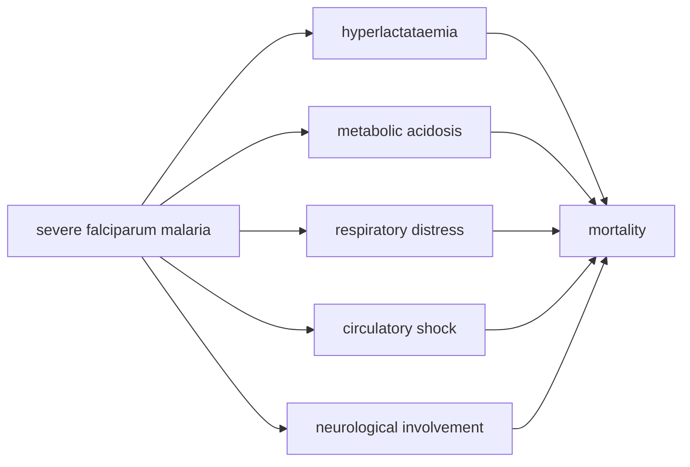

# Mortality

**Therapeutic category:** _Not applicable — mortality is a clinical outcome, not a therapeutic agent._
**Drug group:** _N/A_
**Drug class:** _N/A_
**Controlled substance:** _N/A_

## Overview

Mortality is the death endpoint used across infectious-disease claims in this corpus, not a medication. Current claims attach it to [[plasmodium-falciparum-malaria]] globally [c:e61096eb] [c:ad387568], [[malaria]] in children under five [c:e313b62a], and notifiable infectious diseases in Chinese pediatric populations [c:74b06ea0]. Additional claims link clinical features of severe malaria to mortality co-occurrence [c:546fce01] [c:d70f94c8] [c:f4b05e2f] [c:d878c565] [c:7529d81e]. _No medication-specific claims present._

## Indication (Why is this medication prescribed?)

_Not applicable._ Mortality is an outcome metric tracked across:
- [[plasmodium-falciparum-malaria]] — ~600,000 annual deaths globally, 2021 (pending review) [c:ad387568] [c:e61096eb]
- [[malaria]] in <5y non-immune children, India (pending review) [c:e313b62a]
- Notifiable infectious diseases, China, ages 6–22y — 0.07 deaths/100,000 (CI high 0.21), 2008 vs 2017 baseline (pending review) [c:74b06ea0]

## Mechanism of Action (How does it work?)

_Not applicable — mortality is endpoint, not pharmacologic agent._ Claim set describes pathophysiologic correlates in severe malaria rather than mechanism of a drug:

Co-occurrence claims (inpatient, moderate certainty, pending review): [[hyperlactataemia]] [c:546fce01], [[metabolic-acidosis]] [c:d70f94c8], [[respiratory-distress]] [c:f4b05e2f], [[circulatory-shock]] [c:d878c565], [[neurological-involvement]] [c:7529d81e].

## Dosage and Administration

_No dose claims in current corpus._

## Contraindications (When not to use it)

_Not applicable — mortality is not a prescribed agent._ _No contraindication claims in current corpus._

## Warnings and Precautions

_Not applicable._ Clinical features co-occurring with mortality in severe malaria flag elevated risk and warrant inpatient monitoring [c:546fce01] [c:d70f94c8] [c:f4b05e2f] [c:d878c565] [c:7529d81e]:
- Lactate elevation (pending review)
- Acid-base derangement (pending review)
- Respiratory compromise (pending review)
- Hemodynamic instability (pending review)
- Altered mental status / cerebral involvement (pending review)

## Side Effects

_Not applicable._ _No side-effect claims in current corpus._

## Drug Interactions

_Not applicable._ _No interaction claims in current corpus._

## Storage and Stability

_Not applicable._

---

**Note on entity typing.** Classifier hint marked `medication`, but entity `mortality` is an outcome/endpoint. Recommend reclassification to `outcome` or `clinical-endpoint` in the master sheet. All 9 claims preserved with population/setting qualifiers intact.

---
*Last regenerated: 2026-05-13T19:13:19Z. Source claims: 9. Evidence mix: 9 expert_opinion (all pending review).*
