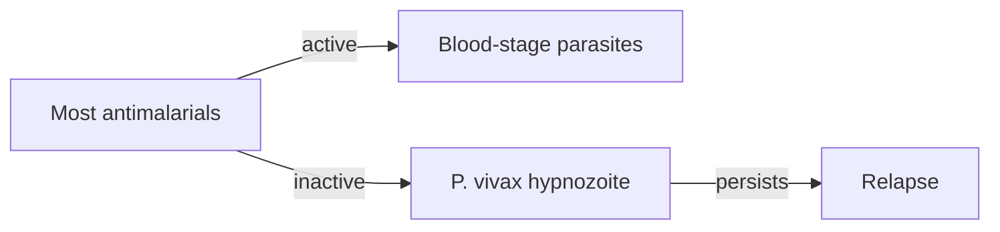

# Most Antimalarial Drugs

**Therapeutic category:** Antimalarial (class aggregate)
**Drug group:** _Not a single agent — refers to the broad antimalarial pharmacopoeia minus hypnozoiticidal 8-aminoquinolines._
**Drug class:** Heterogeneous
**Controlled substance:** _Varies by agent._

## Overview

"Most antimalarial drugs" not single drug. Umbrella term in [[plasmodium-vivax]] literature for blood-stage antimalarials lacking hypnozoiticidal action. Current corpus describe one shared limitation: failure against dormant liver-stage hypnozoites of [[plasmodium-vivax]] (pending review) [c:c1317ee2][c:10af1c9b].

## Indication (Why is this medication prescribed?)

_No indication claims in current corpus._ Class too broad — see individual agent notes ([[chloroquine]], [[artemether-lumefantrine]], [[primaquine]], [[tafenoquine]]).

## Mechanism of Action (How does it work?)

_No mechanism claims in current corpus for class as whole._ Shared negative property: most agents target erythrocytic stages, miss [[hypnozoite]] dormant liver form of [[plasmodium-vivax]] (pending review) [c:c1317ee2][c:10af1c9b].

Diagram supported by [c:c1317ee2][c:10af1c9b] (pending review).

## Dosage and Administration

_No dose claims in current corpus._

## Contraindications (When not to use it)

_No contraindication claims in current corpus._

## Warnings and Precautions

- Monotherapy with most antimalarials insufficient for [[plasmodium-vivax]] radical cure — [[hypnozoite]] reservoir survives, drives [[vivax-relapse]] in endemic settings (pending review) [c:c1317ee2] (expert_opinion).
- Class-wide gap: hypnozoiticidal coverage requires 8-aminoquinoline add-on ([[primaquine]] or [[tafenoquine]]) (pending review) [c:10af1c9b] (expert_opinion).

## Side Effects

_No side-effect claims in current corpus._

## Drug Interactions

_No interaction claims in current corpus._

## Storage and Stability

_No storage claims in current corpus._

---
*Last regenerated: 2026-05-13T19:13:43.825900+00:00. Source claims: 2. Evidence mix: 2 expert_opinion (both pending review, same source PMID:34474178).*
