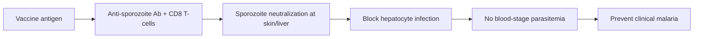

# P. falciparum Malaria — Preventive Vaccines

**Therapeutic category:** Antimalarial vaccine (prevention)
**Drug group:** Pre-erythrocytic malaria vaccines
**Drug class:** Sporozoite-based (whole-organism) and recombinant subunit vaccines
**Controlled substance:** No

> _Note: source entity `[[p-falciparum-malaria]]` is a disease, not a single drug. Current claim set describes three investigational/deployed vaccines targeting it. Note scoped accordingly._

## Overview

Vaccines aimed at preventing [[p-falciparum-malaria]], caused by *Plasmodium falciparum* sporozoite infection. Three agents in current corpus: [[pfspz-vaccine]] (irradiated sporozoite), [[pfspz-cvac]] (chemoattenuated sporozoite under drug cover), and [[r21-vaccine]] (recombinant circumsporozoite subunit). All entries `(pending review)`.

## Indication (Why is this medication prescribed?)

- Prevention of [[p-falciparum-malaria]] via [[pfspz-vaccine]] (irradiated sporozoite) [c:3ea70610] *(pending review, expert_opinion)*
- Prevention of [[p-falciparum-malaria]] via [[pfspz-cvac]] (chemoattenuated sporozoite under chemoprophylaxis cover) [c:0a197d0b] *(pending review, expert_opinion)*
- Prevention of [[p-falciparum-malaria]] via [[r21-vaccine]] in African endemic settings [c:10d60266] *(pending review, expert_opinion)*

## Mechanism of Action (How does it work?)

Pre-erythrocytic vaccines induce immunity against sporozoite and liver-stage parasites, blocking infection before blood-stage disease. Whole-sporozoite platforms ([[pfspz-vaccine]], [[pfspz-cvac]]) deliver attenuated parasites; R21 is a recombinant [[circumsporozoite-protein]] virus-like particle [c:3ea70610] [c:0a197d0b] [c:10d60266].

[c:3ea70610] [c:0a197d0b] [c:10d60266]

## Dosage and Administration

_No dose claims in current corpus._

Population qualifier present only for [[r21-vaccine]]: African endemic-region recipients [c:10d60266].

## Contraindications (When not to use it)

_No contraindication claims in current corpus._

## Warnings and Precautions

_No warning/precaution claims in current corpus._

## Side Effects

_No adverse-event claims in current corpus._

## Drug Interactions

_No interaction claims in current corpus._ Note: [[pfspz-cvac]] regimen requires concurrent antimalarial chemoprophylaxis during immunization per mechanism [c:0a197d0b].

## Storage and Stability

_No storage claims in current corpus._ Whole-sporozoite products historically require cryopreservation; not asserted by current claims.

---
*Last regenerated: 2026-05-13T19:15:40Z. Source claims: 3 (all pending_review). Evidence mix: 3 expert_opinion. Single source: PMID:37728713.*
