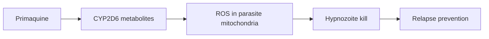

# Primaquine

**Therapeutic category:** Antimalarial
**Drug group:** Hypnozoiticide (radical cure)
**Drug class:** 8-aminoquinoline
**Controlled substance:** No

## Overview

Primaquine clears dormant liver-stage hypnozoites of [[plasmodium-vivax]] and [[plasmodium-ovale]], preventing relapse after blood-stage cure. Used as radical-cure adjunct alongside schizonticide. G6PD status gate required before dosing — hemolysis risk in G6PD-deficient patients.

## Indication (Why is this medication prescribed?)

- Radical cure of [[plasmodium-vivax]] hypnozoites in G6PD-replete, non-pregnant outpatients [c:d4b0c986] *(pending review)*
- Radical cure of [[plasmodium-ovale]] hypnozoites in G6PD-replete, non-pregnant outpatients [c:d4b0c986] *(pending review)*
- Relapse prevention in UK travelers returning with vivax/ovale malaria (outpatient setting) [c:13b5dd8d] *(pending review)*

## Mechanism of Action (How does it work?)

Targets liver-stage [[hypnozoite]] forms that blood schizonticides miss. Active metabolites generate reactive oxygen species disrupting parasite mitochondria, eradicating dormant reservoir and breaking relapse cycle [c:d4b0c986].

## Dosage and Administration

_No dose claims in current corpus._ Current claims confirm indication only; mg/kg, frequency, and duration not specified [c:d4b0c986][c:13b5dd8d].

## Contraindications (When not to use it)

- **Absolute:** G6PD deficiency — hemolysis risk (inferred guard from G6PD-replete qualifier on both claims) [c:d4b0c986][c:13b5dd8d]
- **Absolute:** Pregnancy — both claims restricted to `not_pregnant` population [c:d4b0c986][c:13b5dd8d]

## Warnings and Precautions

- Confirm G6PD status before prescribing — both supporting claims gated on G6PD-replete population [c:d4b0c986]
- Outpatient use supported; inpatient/severe-malaria context not covered by current corpus [c:d4b0c986][c:13b5dd8d]
- Evidence grade `expert_opinion` (UK guideline) — monitor for guideline updates

## Side Effects

_No side-effect claims in current corpus._ Class-known hemolysis risk in G6PD-deficient patients is the basis for the G6PD gate above [c:d4b0c986].

## Drug Interactions

_No interaction claims in current corpus._

## Storage and Stability

_No storage claims in current corpus._

---
*Last regenerated: 2026-05-13T19:16:05Z. Source claims: 2. Evidence mix: 2 expert_opinion (UK guideline PMID:26880088).*
